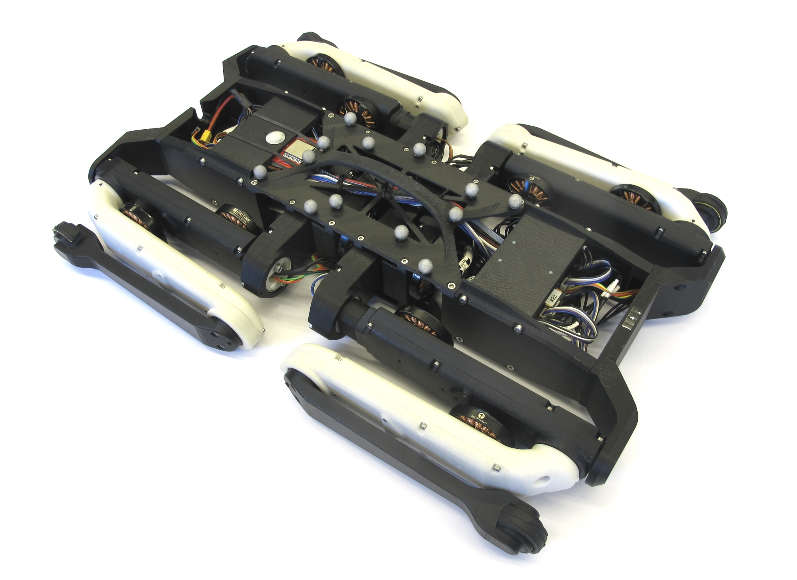
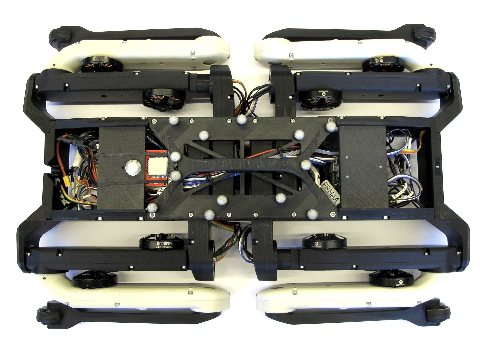
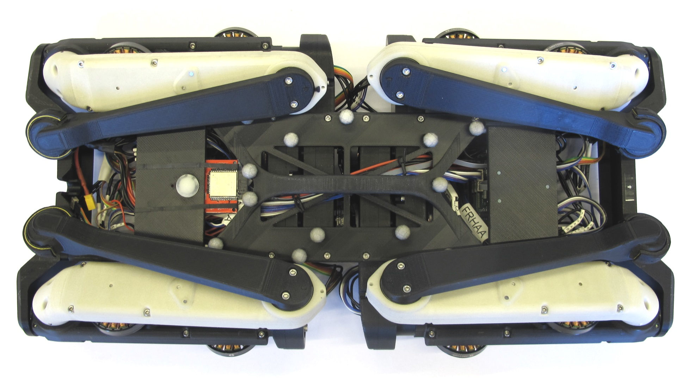
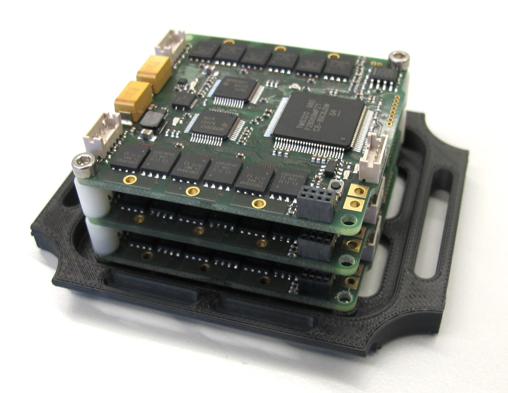

Quadruped Robot 12dof v1
=======================
 *CAD model 12 dof quadruped robot*  

Dimensions
------------
     

Description
----------------
* 12dof - 12 degree of freedom robot
* consisting of 4 identical legs - details here -> [3DOF Leg](../leg_3dof_v1)  

Range of motion
---------------
  

Pictures
-----------
    
    
    
    

3D Printed Parts
-----------------
  
  

* All the STL files for 3d printing the body structure can be found here: [STL Files Body Structure](stl_files).

Electronics
-----------
     
___
Off-the-shelf Components
--------------------------

### Hip AA Bearing

  

There is a new type of bearing requried for the hip aa support.  
The bearing dimensions are smaller to enable maximal range of motion of the leg.  
We order the bearings in stainless steel from SBN.  
* Dimensions: 25mm x 20mm x 4mm  
* SBN part number: ET2520 2Z VA

### Inertia Measurement Unit

  

* Lord Microstrain 3DM-CX5-25

___
### Vicon Markers
  *Reflective Markers for motion capture system*

* 9.5mm Vicon Markers on the base
* M4 x 10 set screws for a attachment  
____

### 3D Model for Visualization

The simplified STL files for visualization and simulation can be found here: [STL Files Visualization](stl_files_for_visualization)

 *Click on picture above to view the PDF drawing*

Authors
--------
Felix Grimminger

License
-------
BSD 3-Clause License

Copyright
-----------
Copyright (c) 2019, Max Planck Gesellschaft, New York University

More Information
----------------
[Open Dynamic Robot Initiative - Webpage](https://open-dynamic-robot-initiative.github.io)  
[Open Dynamic Robot Initiative - YouTube Channel](https://www.youtube.com/channel/UCx32JW2oIrax47Gjq8zNI-w)   
[Hardware Overview](../../README.md)  
[Software Overview](https://github.com/open-dynamic-robot-initiative/open-dynamic-robot-initiative.github.io/wiki)
