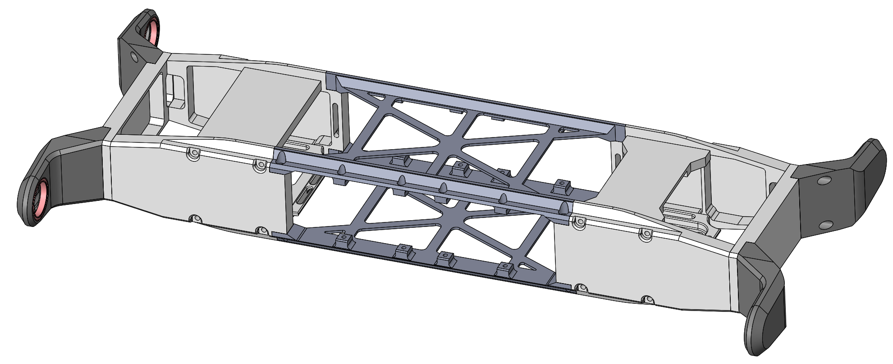
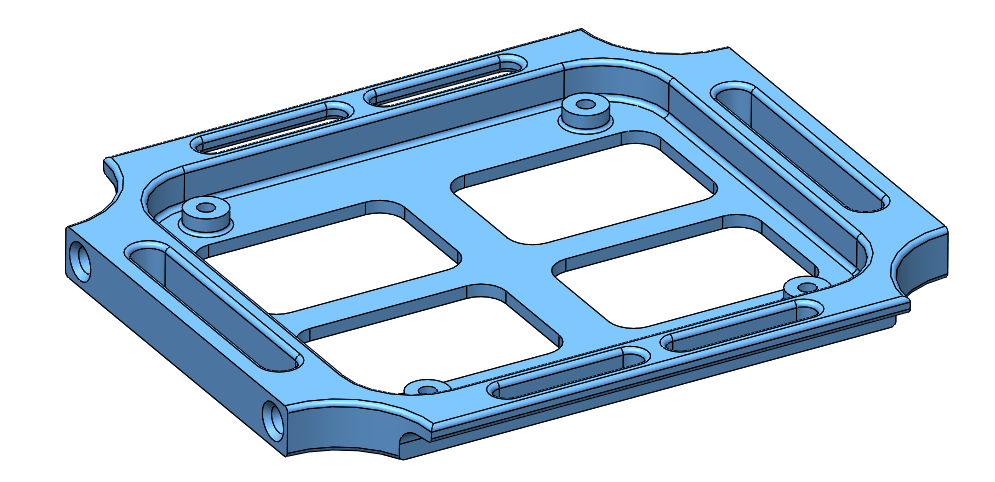
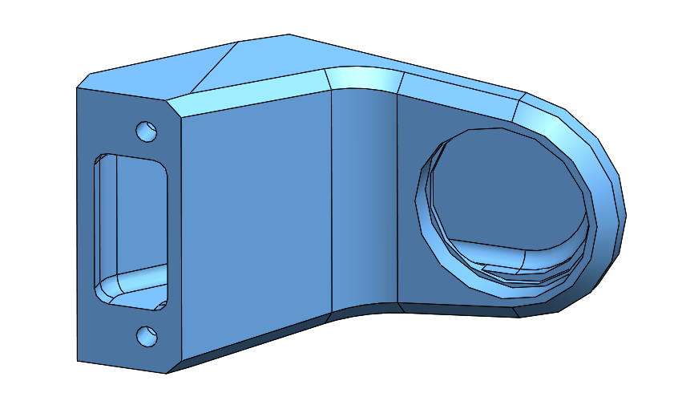
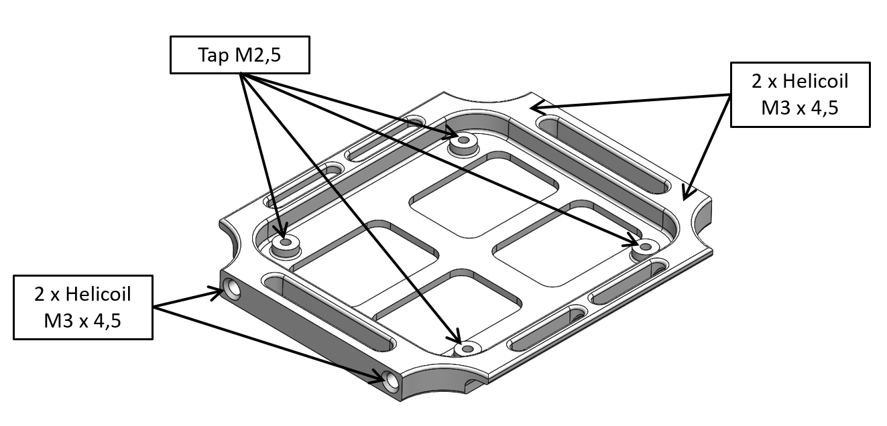

# Quadruped Robot 12dof v1
 *CAD model 12 dof quadruped robot*  

 *12dof quadruped robot*   

## Dimensions
    

## Description
* 12dof - 12 degree of freedom robot
* current control at 10kHz / communication with control pc at 1kHz
* dimensions: 45cm x 32cm x 6cm
* weight: 2,5kg
* consisting of 4 identical leg modules - details here -> [3DOF Leg](../leg_3dof_v1)
* external wire for power supply and ethernet communication

## Range of motion
  
* the standard hip aa range of motion is 215 degrees
* the effective hip aa range of motion can be extended to 325 degrees if the hip fe dof is moved simultaniously

## Pictures
 *12dof quadruped without electronics*   
 *12dof quadruped with electronics and vicon top plate*   
 *12dof quadruped top view* 
 *12dof quadruped front view*   
 *12dof quadruped - legs folded for transport*   

## Electronics
### Master Board
   *Master board v2 - weight: 19g*
* Custom electronics board -> [Master Board Documentation](https://github.com/open-dynamic-robot-initiative/master-board#master-board)
---
### Micro Driver
   *Micro Driver v2 - Stack with 3 cards - weight: 41g*

* Custom electronics board -> [Micro Driver Board Documentation](../../electronics/micro_driver_electronics/README.md)
---
### Inertia Measurement Unit
  
* Lord Microstrain 3DM-CX5-25
* Weight: 13g
* [Lord Microstrain webpage](https://www.microstrain.com/inertial/3dm-cx5-25)
* We use the imu with an extended measurement range
  * Gyro Rate: +/- 900 deg/sec.
  * Accelerometer range: +/- 20G
---

## 3D Printed Parts
  
  

* All the STL files for 3d printing the body structure can be found here: [STL Files Body Structure](stl_files).  

---
  
* [Body Structure Back - STL file](stl_files/body_structure_back.STL) 
* weight: 12g
* the recommended printing direction is the positive z direction of the stl file
---
  
* [Body Structure Bottom - STL file](stl_files/body_structure_bottom.STL) 
* weight: 9g
* the recommended printing direction is the positive z direction of the stl file
---
  
* [Body Structure Center - STL file](stl_files/body_structure_center.STL) 
* weight: 24g
* the recommended printing direction is the positive z direction of the stl file
---
  
* [Body Structure Center Vicon- STL file](stl_files/body_structure_center_vicon.STL) 
* weight: 30g
* the recommended printing direction is the positive z direction of the stl file
---
  
* [Body Structure Center Handle- STL file](stl_files/body_structure_center_handle.STL) 
* weight: 29g
* the recommended printing direction is the positive z direction of the stl file
---
  
* [Body Structure Front - STL file](stl_files/body_structure_front.STL) 
* weight: 12g
* the recommended printing direction is the positive z direction of the stl file
---
  
* [Body Structure Hip AA Support - STL file](stl_files/body_structure_hip_aa_support.STL) 
* weight: 18g
* the recommended printing direction is the positive z direction of the stl file
---
  
* [Body Structure Side - STL file](stl_files/body_structure_side.STL) 
* weight: 18g
* the recommended printing direction is the positive z direction of the stl file
---
  
* [Body Structure Top IMU - STL file](stl_files/body_structure_top_imu.STL) 
* weight: 12g
* the recommended printing direction is the positive z direction of the stl file
---
  
* [Body Structure Top Master Board - STL file](stl_files/body_structure_top_master_board.STL) 
* weight: 11g
* the recommended printing direction is the positive z direction of the stl file
---
  
* [Hip Adapter - STL file](stl_files/hip_adapter.STL) 
* weight: 5g
* the recommended printing direction is the positive z direction of the stl file
---
## Preparing the 3d printed parts
  

  

  

  

  

---

## Off-the-shelf Components
### Hip AA Bearing
  

The bearing dimensions of the hip aa support are smaller to enable maximal range of motion of the leg.  
We order the bearings in stainless steel from SBN.  
* Dimensions: 25mm x 20mm x 4mm  
* SBN part number: ET2520 2Z VA
* Weight: 3,4g each

### Fasteners IMU
  
* M2,5x16 Slotted Screw - Polyamide Plastic
* Conrad: 839940-62
---
## Vicon Object
  *Vicon Object - weight: 43g*  

* You can use this Vicon object for base state estimation
* It can be installed instead of the Body Structure Center Plate on the top
* You can download the Vicon Object here: [Solo12 Vicon Object](details/solo12.vsk)

 *Click on picture above to view the PDF drawing*

### Vicon Markers
  *Reflective Markers for motion capture system*
* 9.5mm Vicon Markers on the base
* M4 x 10 set screws for a attachment  
* Weight: 1g each
---
### 3D Model for Visualization

The simplified STL files for visualization and simulation can be found here: [STL Files Visualization](stl_files_for_visualization)

 *Click on picture above to view the PDF drawing*

## Micro Driver Stack Motor Assignment
   

---
   

| Joint ID | Joint Name | Motor Driver Card | Motor Port |Motor Index |
| --- | --- | --- | --- | ---|
|0|FL_HAA|0|0|0|
|1|FL_HFE|1|1|3|
|2|FL_K|1|0|2|
|3|FR_HAA|0|1|1|
|4|FR_HFE|2|1|5|
|5|FR_K|2|0|4|
|6|HL_HAA|3|0|6|
|7|HL_HFE|4|1|9|
|8|HL_K|4|0|8|
|9|HR_HAA|3|1|7|
|10|HR_HFE|5|1|11|
|11|HR_K|5|0|10|

---

## Bill of Materials - Quadruped Robot 12dof

| Part Name | Quantity | Ordering Information | Comments |  
| --- | --- | --- | --- |   
|3DOF Leg |4|Custom assembly|[3DOF Leg Documentation](../leg_3dof_v1/README.md)|
|Body Structure Back |1|[STL file](stl_files/body_structure_back.STL)|3d printed part|
|Body Structure Bottom |2|[STL file](stl_files/body_structure_bottom.STL)|3d printed part|
|Body Structure Center |1|[STL file](stl_files/body_structure_center.STL)|3d printed part|
|Body Structure Front |1|[STL file](stl_files/body_structure_front.STL)|3d printed part|
|Body Structure Hip AA Support |4|[STL file](stl_files/body_structure_hip_aa_support.STL)|3d printed part|
|Body Structure Side |4|[STL file](stl_files/body_structure_side.STL)|3d printed part|
|Body Structure Top IMU |1|[STL file](stl_files/body_structure_top_imu.STL)|3d printed part|
|Body Structure Top Master Board |1|[STL file](stl_files/body_structure_top_master_board.STL)|3d printed part|
|Hip Adapter|2|[STL file](stl_files/hip_adapter.STL)|3d printed part|
| Hip AA Bearing | 4 | 25mm x 20mm x 4mm   SBN: ET2520 2Z VA| Stainless Steel |
| Inertia Measurement Unit | 1 | Lord Microstrain  3DM-CX5-25| Extended measurement range  Gyro Rate: +/- 900 deg/sec. Accelerometer range: +/- 20G|
| Vicon Markers | 13 | 9,5mm diameter |  |
| Fasteners Vicon Markers | 13 |M4x10 Set Screw|Stainless steel|
| Master Board v2 | 1 | [Master Board Documentation](https://github.com/open-dynamic-robot-initiative/master-board#master-board) | Custom Electronics |
| Micro Driver Board v2 | 6 | [Micro Driver Documentation](../../electronics/micro_driver_electronics/README.md)  | Custom electronics |
|Fasteners Body Structure Side|16|M3x12 Socket Head Cap Screw|Stainless steel|
|Fasteners Body Structure Top|8|M3x8 Socket Head Cap Screw|Stainless steel|
|Fasteners Hip AA Actuator Modules|16|M2,5x10 Socket Head Cap Screw|Stainless steel|
|Fasteners Hip AA Support|8|M3x14 Socket Head Cap Screw|Stainless steel|
|Fasteners Micro Driver Stack|4|M2,5x25 Socket Head Cap Screw|Stainless steel|
|Fasteners IMU|3|M2,5x16 Slotted Screw Conrad 839940-62|Polyamide Plastic Shorten to 13mm|

## View the biped cad model in your web browser
 

 *Quadruped robot 12dof standing - Click on picture to view the cad model in your browser*

 *Quadruped robot 12dof folded - Click on picture to view the cad model in your browser*

## Authors
Felix Grimminger

## License
BSD 3-Clause License

## Copyright
Copyright (c) 2019-2020, Max Planck Gesellschaft and New York University

## More Information
[Open Dynamic Robot Initiative - Webpage](https://open-dynamic-robot-initiative.github.io)  
[Open Dynamic Robot Initiative - YouTube Channel](https://www.youtube.com/channel/UCx32JW2oIrax47Gjq8zNI-w)   
[Open Dynamic Robot Initiative - Forum](https://odri.discourse.group/categories)  
[Open Dynamic Robot Initiative - Paper](https://arxiv.org/pdf/1910.00093.pdf)  
[Hardware Overview](../../README.md#open-robot-actuator-hardware)  
[Software Overview](https://github.com/open-dynamic-robot-initiative/open-dynamic-robot-initiative.github.io/wiki)
