# Quadruped Robot 12dof v1

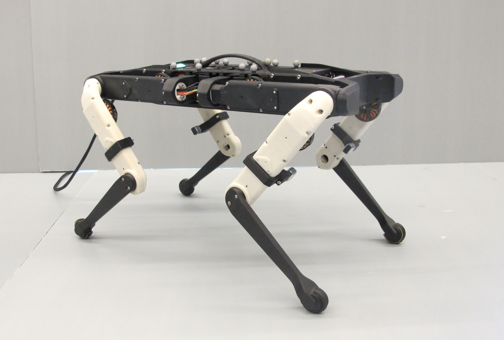 *12dof Quadruped Robot - weight: 2,5kg*   

## Commercial Option

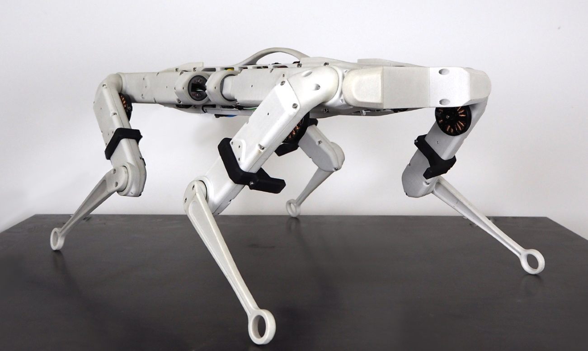 *Solo12 Quadruped Robot. Picture source: PAL Robotics*   

The Solo12 robot is now commercially available from PAL Robotics.
You can purchase the fully assembled robot or you can order a kit with all the components that are required and assemble the robot yourself.

* [PAL Robotics - Solo12 Product Page](https://solo.pal-robotics.com/solo)

Both options include the [inertia measurement unit](#inertia-measurement-unit), the [calibration tools](../general/robot_calibration.md#calibration-tool-quadruped-12dof) and the three different [center plate options](#body-module). The [Micro Driver Board Programmer](../../electronics/micro_driver_electronics/README.md#flash-adapter-and-flash-wire) and the [Master Board Programmer](https://github.com/open-dynamic-robot-initiative/master-board/blob/master/firmware/README.md#flashing-the-firmware) are included as well.

All the information on how to order the components and build the robot yourself can be found below.

## Description

* this page describes all the components that are required to build the Quadruped Robot with 12 active degrees of freedom
* the robot consists of a body module and 4 identical 3dof legs
* the 3dof legs are described on a separate page: [Leg 3dof v1](../leg_3dof_v1/README.md#leg-3dof-v1)
* the robot has a connection wire for power supply and ethernet communication
* we are working on a new version with onboard batteries and wireless communication: [Quadruped Robot v1.1 - Autonomy Upgrade](../quadruped_robot_12dof_v1.1/README.md#quadruped-robot-12dof-v11)

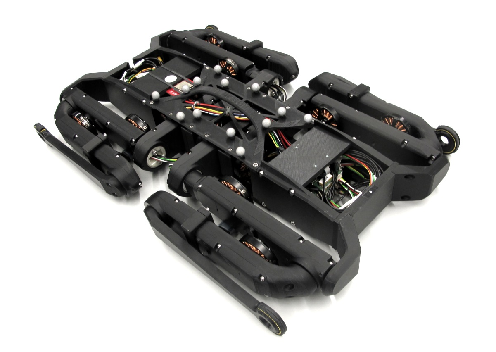 *Quadruped Robot 12dof*   
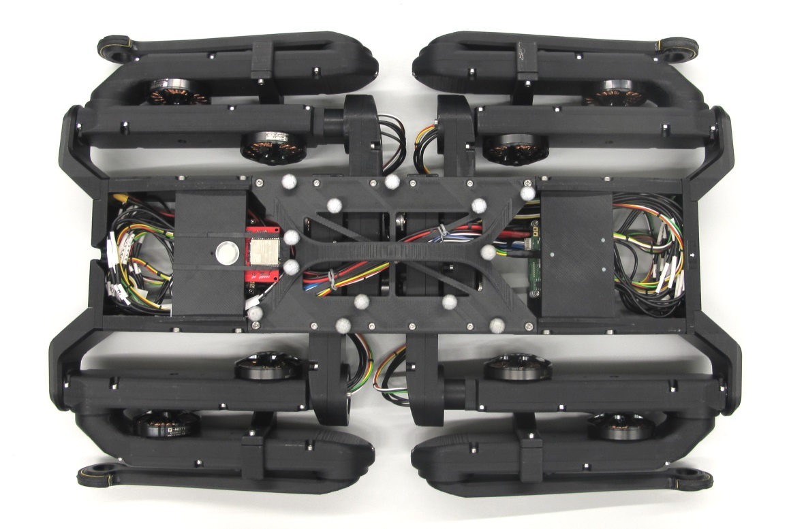 *Quadruped Robot 12dof - Top View* 
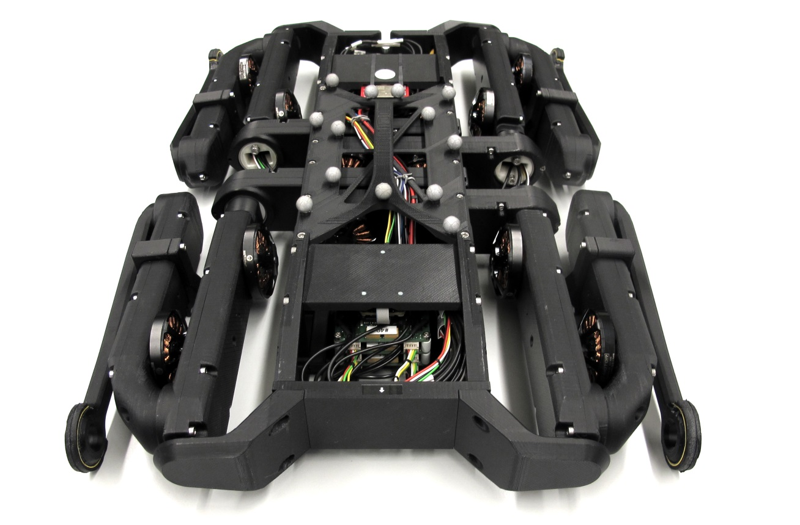 *Quadruped Robot 12dof - Front View*   
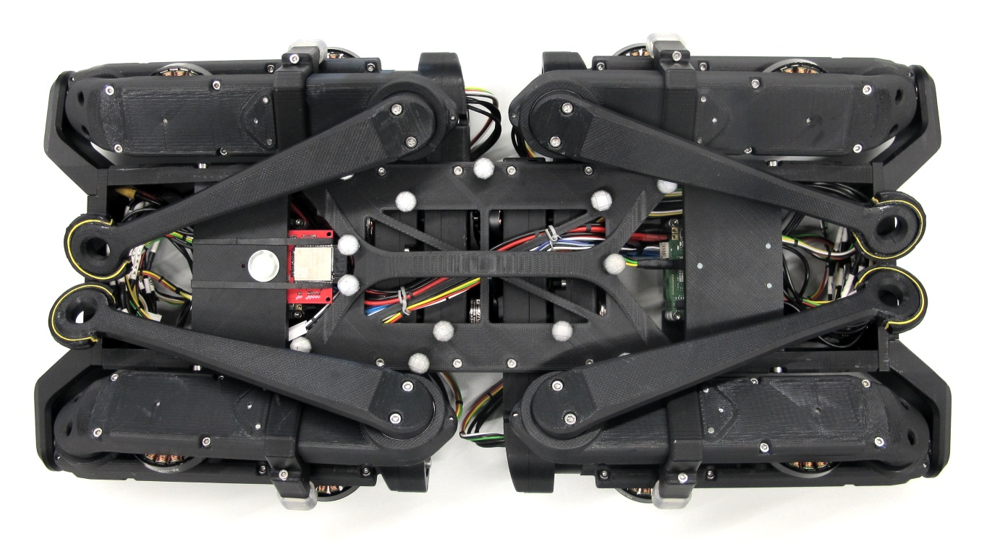 *Quadruped Robot 12dof - legs folded for transport*   

## Dimensions
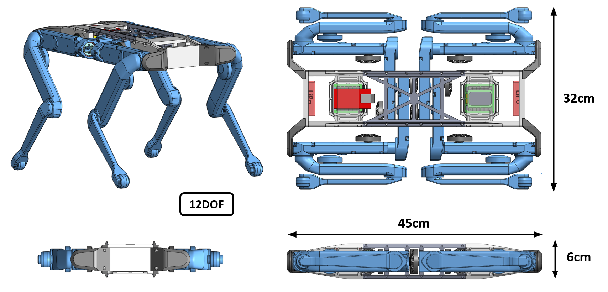 *Quadruped Robot Dimensions: 45cm x 30cm x 6cm*

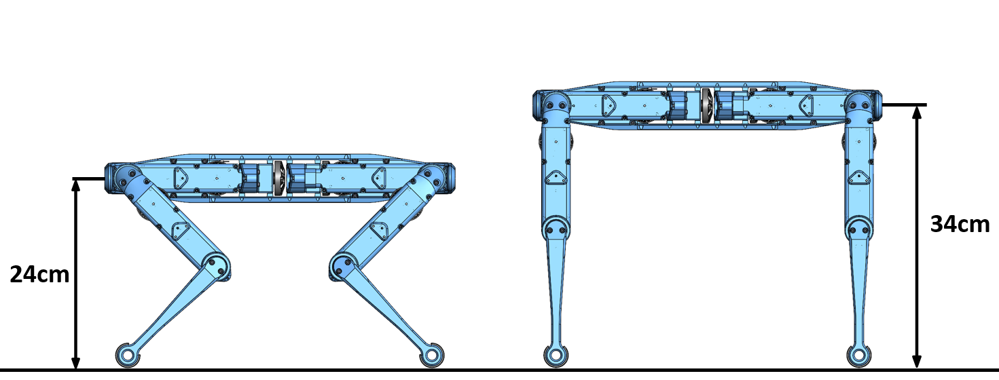 *Quadruped Robot Hip Height*

## Range of Motion
  
* the standard Hip AA range of motion is 215 degrees
* the effective Hip AA range of motion can be extended to 325 degrees if the Hip FE joint is moved simultaneously

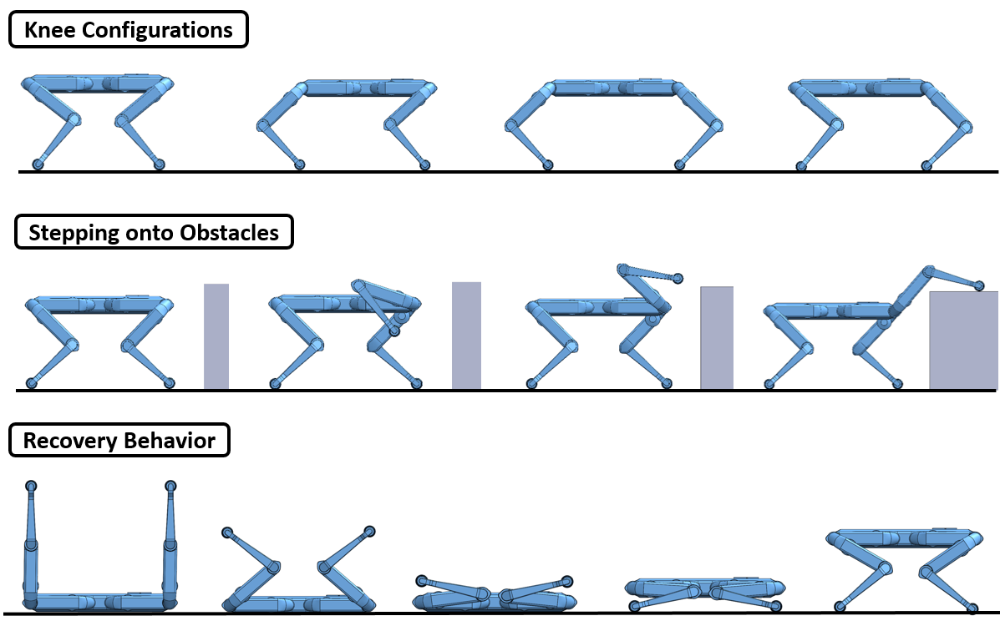  

* the Knee and Hip FE degrees of freedom can perform multiple rotations
* this enables the robot to step onto obstacles or to recover from a fall
* the wires that are routed through the Hip FE joint limit the number of rotations that can be performed

## Leg Modules
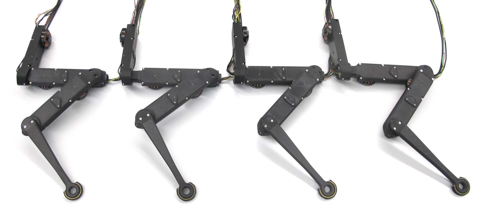 *3dof Leg Modules - weight: 485g each* 

* [Leg 3dof v1 Documentation](../leg_3dof_v1/README.md#leg-3dof-v1)

## Hip Adapters

 *The hip adapters are installed on the front right and the hind left leg.*

## Body Module
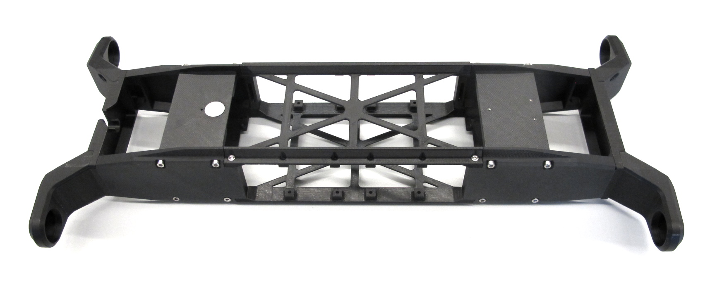 *Body Structure - weight: 300g* 

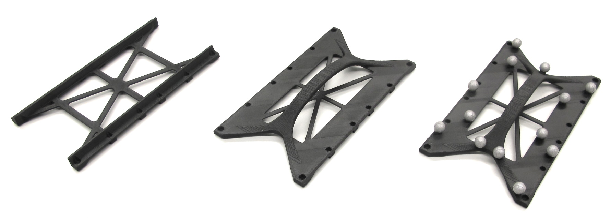 *Body Structure Center Plates - 3 different versions are available.* 

## Electronics
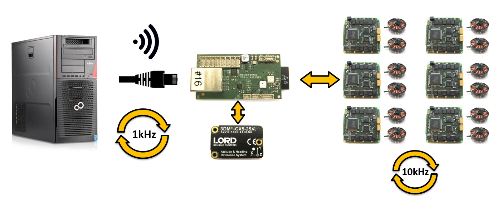   *Electronic Component Overview* 

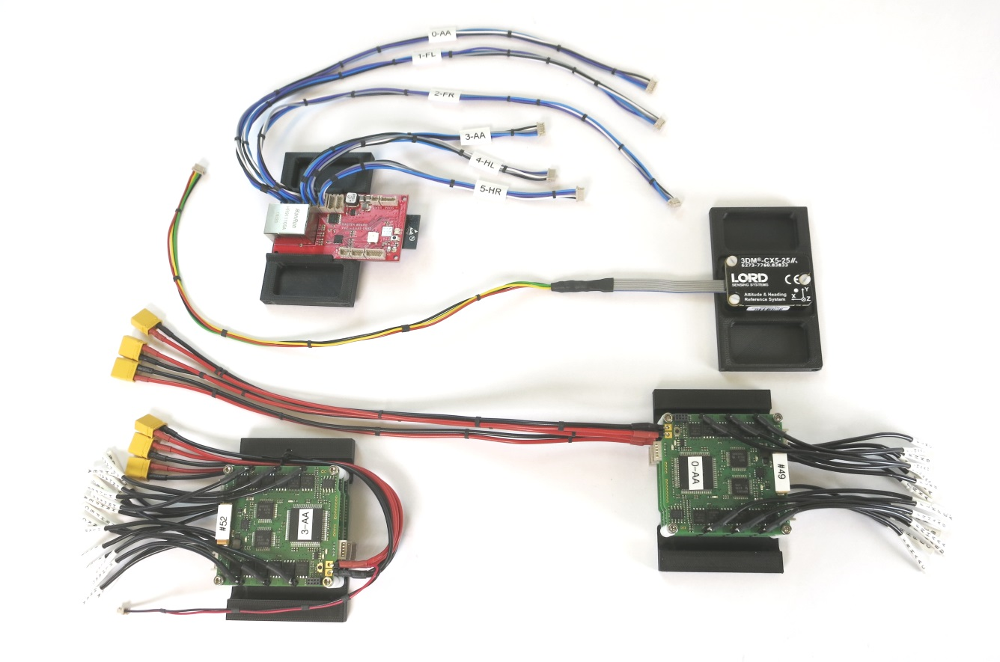   *Electronic Components Quadruped Robot* 

### Master Board
   *Master Board v2 - weight: 19g each*
* Custom electronics board: [Master Board Documentation](https://github.com/open-dynamic-robot-initiative/master-board#master-board)
* [Master Board Wiring Documentation](details/details_electronics_quadruped_12dof.md#master-board)

### Micro Driver Boards
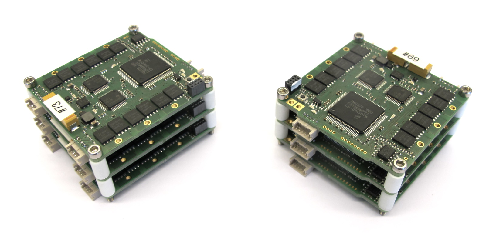   *Micro Driver Stacks for Quadruped Robot - weight: 94g*

* Custom electronics board: [Micro Driver Board Documentation](../../electronics/micro_driver_electronics/README.md)
* [Micro Driver Wiring Documentation](details/details_electronics_quadruped_12dof.md#micro-driver-stack-front)

### Inertia Measurement Unit
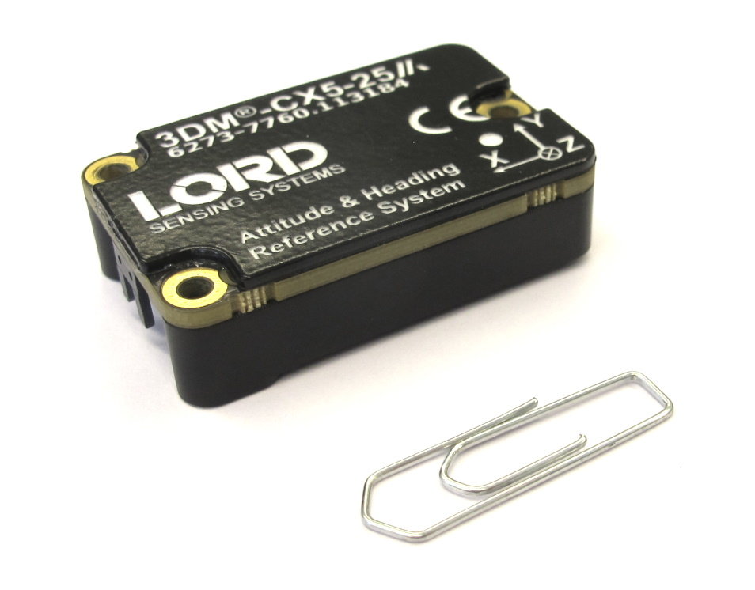 *Inertia Measurement Unit - weight: 13g* 
* Lord Microstrain 3DM-CX5-25
* [3DM-CX5-25 Product Page](https://www.microstrain.com/inertial/3dm-cx5-25)
* We use the imu with an extended measurement range
  * Gyro Rate: +/- 900 deg/sec.
  * Accelerometer range: +/- 20G
* If you want to use a different IMU, you might want to have a look at [this post in the ODRI Forum](https://odri.discourse.group/t/using-imu-lord-microstrain-3dm-gx4-45/202/4?u=ferdinand-wood)
* [IMU Wiring Documentation](details/details_electronics_quadruped_12dof.md#inertia-measurement-unit)
* Ordering information [below](#bill-of-materials---quadruped-robot-12dof)

## 3D Printed Parts
 *3D Printed Body Structure Components - weight: 270g*

* All the STL files for 3d printing the body structure can be found here: [STL Files Body Structure](stl_files).  

 

`The recommended printing direction for all the parts below is the positive z direction of the stl files.`

---
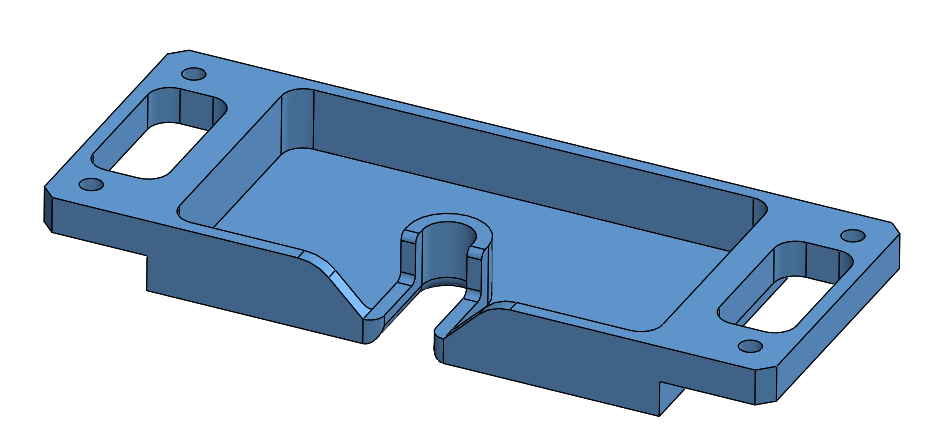  
* [Body Structure Back - STL file](stl_files/body_structure_back.STL) 
* weight: 12g
---
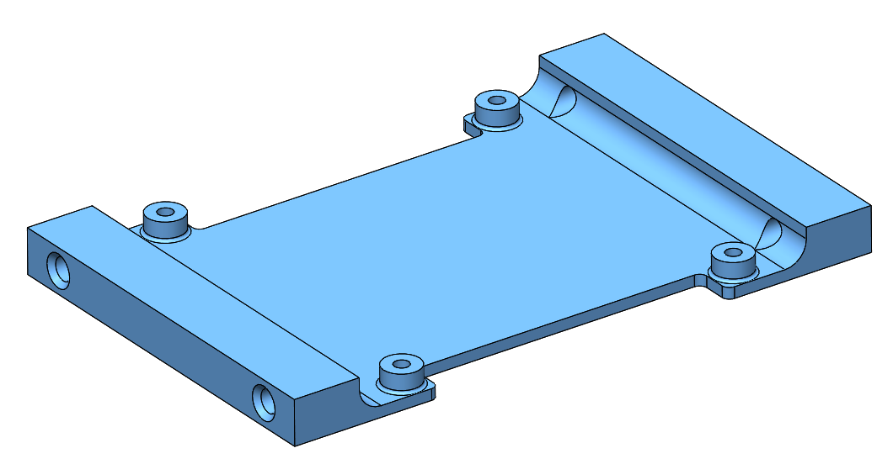  
* [Body Structure Bottom Rev A - STL file](stl_files/body_structure_bottom_rev_a.STL) 
* for Micro Driver boards with 90 degree Hirose encoder connectors
* weight: 10g
---
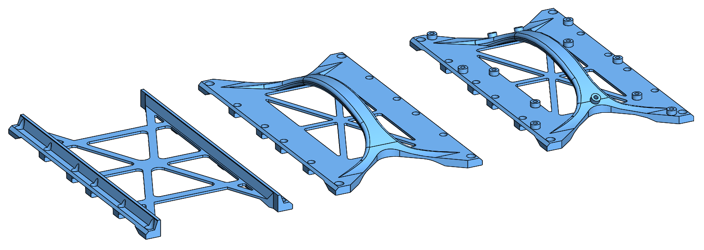 *There are 3 different versions for the body structure center top plate. Minimal, with handle and with handle and Vicon marker attachments.*  

---
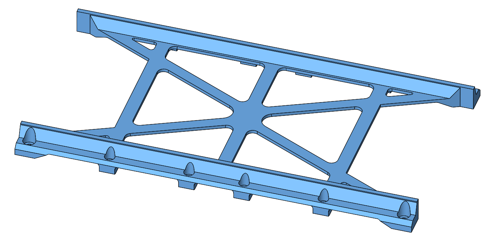  
* [Body Structure Center - STL file](stl_files/body_structure_center.STL) 
* this part can be used on the bottom and the top of the robot
* weight: 24g
---
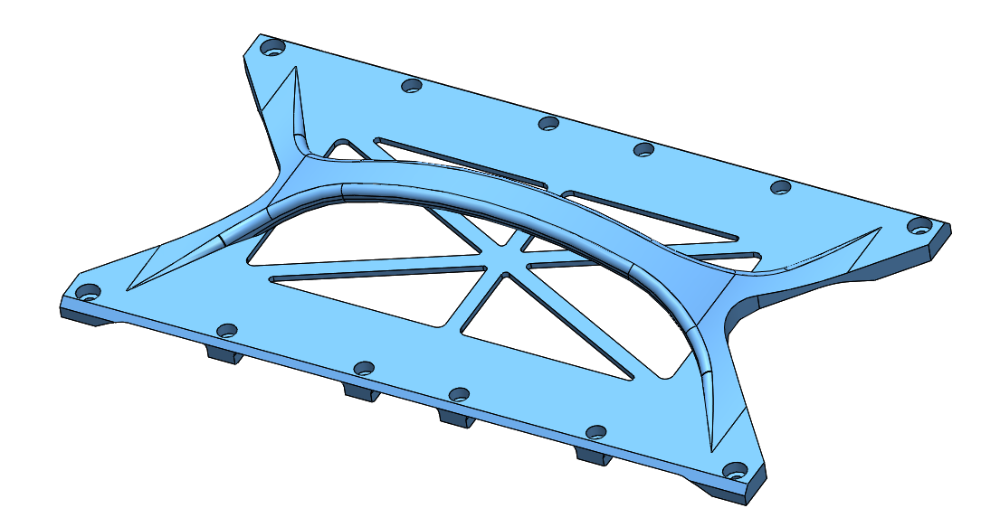  
* [Body Structure Center Handle- STL file](stl_files/body_structure_center_handle.STL) 
* weight: 29g
---
  
* [Body Structure Center Vicon- STL file](stl_files/body_structure_center_vicon.STL) 
* weight: 30g
---
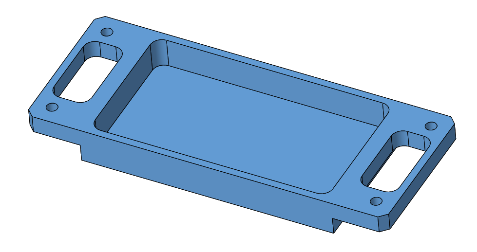  
* [Body Structure Front - STL file](stl_files/body_structure_front.STL) 
* weight: 12g
---
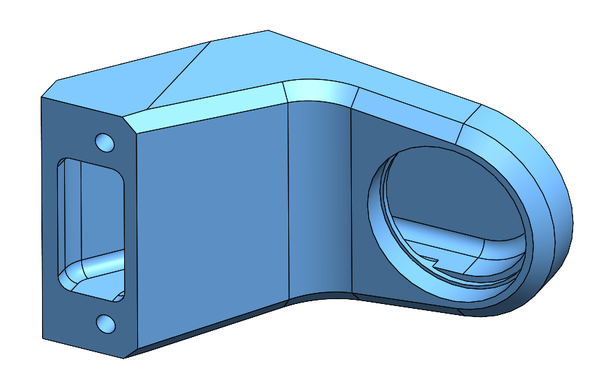  
* [Body Structure Hip AA Support Rev A - STL file](stl_files/body_structure_hip_aa_support_rev_a.STL) 
* weight: 20g

---
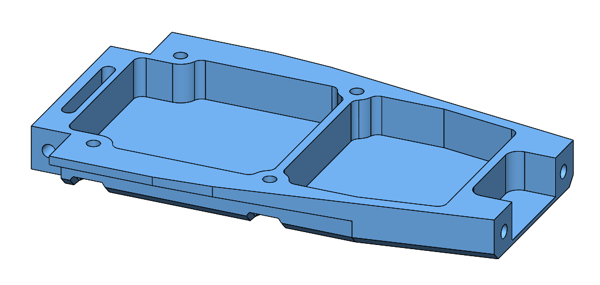  
* [Body Structure Side - STL file](stl_files/body_structure_side.STL) 
* weight: 18g

---
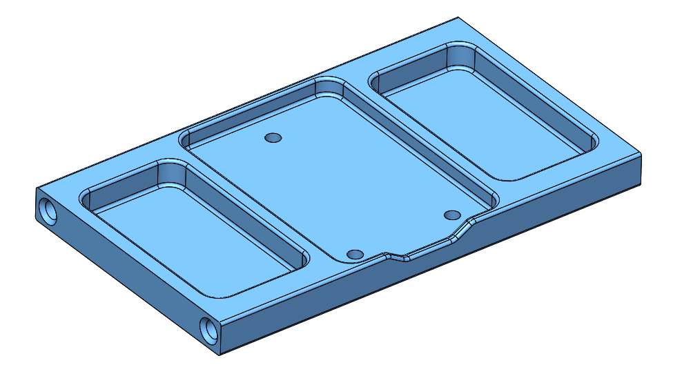  
* [Body Structure Top IMU - STL file](stl_files/body_structure_top_imu.STL) 
* weight: 12g

---
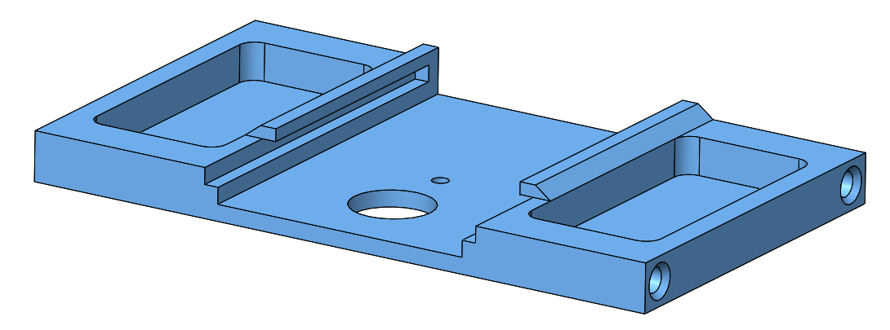  
* [Body Structure Top Master Board - STL file](stl_files/body_structure_top_master_board.STL) 
* weight: 11g
---
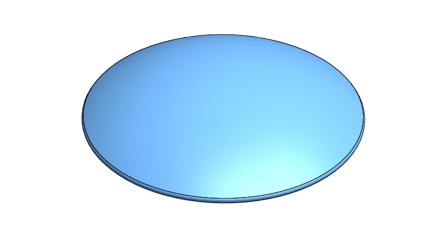  
* [Led cover - STL file](stl_files/led_cover.STL) 
* weight: 0,4g
* Print with transparent or translucent material
---
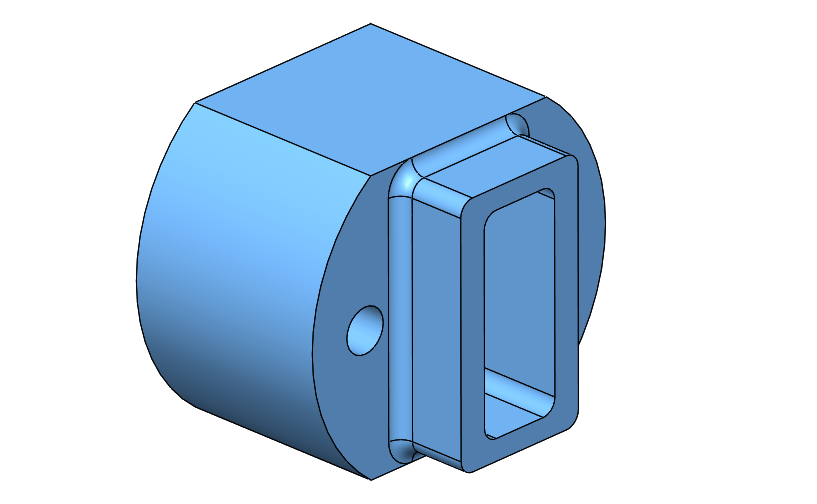  
* [Hip Adapter - STL file](stl_files/hip_adapter.STL) 
* weight: 5g

---
  
* [Micro Driver Stack Spacer - STL file](stl_files/spacer_micro_driver_stack.STL)
* weight: 0,1g
---

## Off-the-shelf Components
### Hip AA Bearing
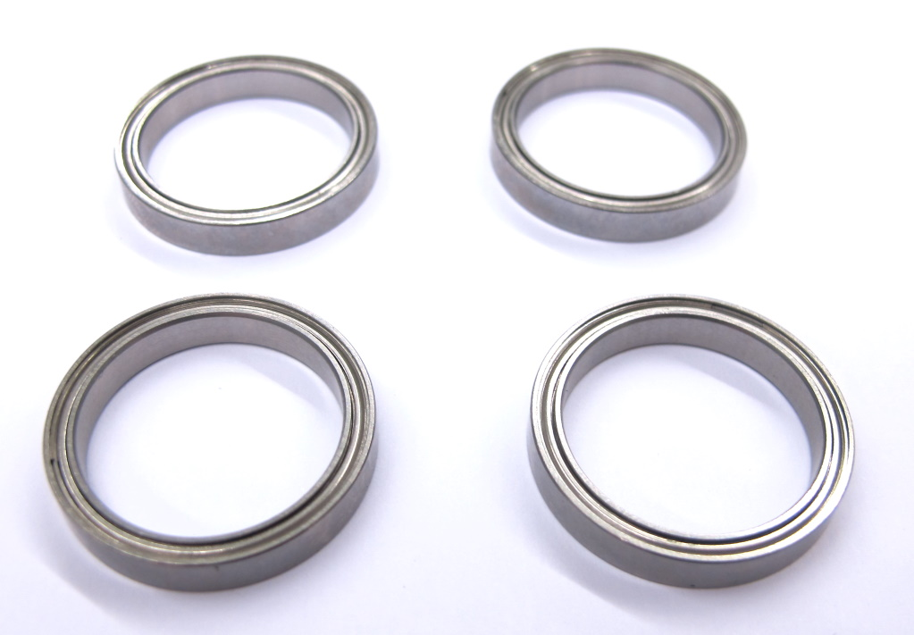 *Hip AA bearings - weight: 3,4g each*

* Stainless steel bearings for Hip AA dof
* Dimensions: 25mm x 20mm x 4mm  
* Ordering information [below](#bill-of-materials---quadruped-robot-12dof)

### Fasteners

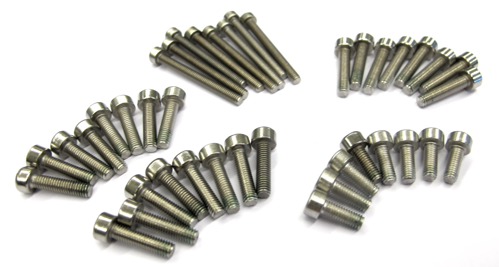  
* stainless steel fasteners
* Ordering information [below](#bill-of-materials---quadruped-robot-12dof)

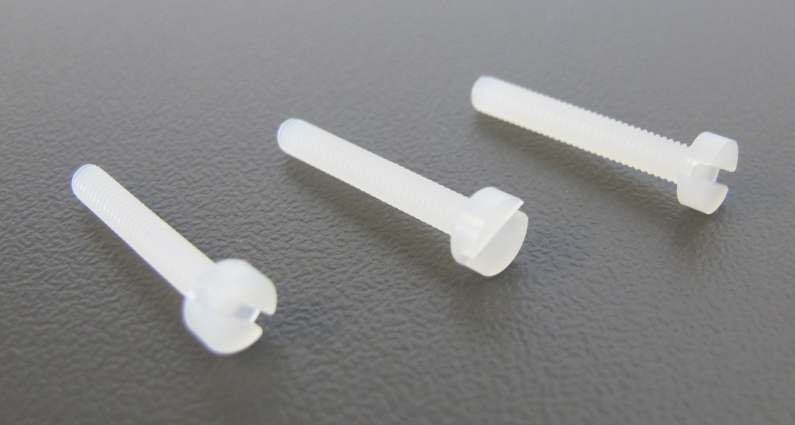  
* Plastic M2,5 fasteners for the IMU
* Ordering information [below](#bill-of-materials---quadruped-robot-12dof)

### Helicoil Thread Inserts

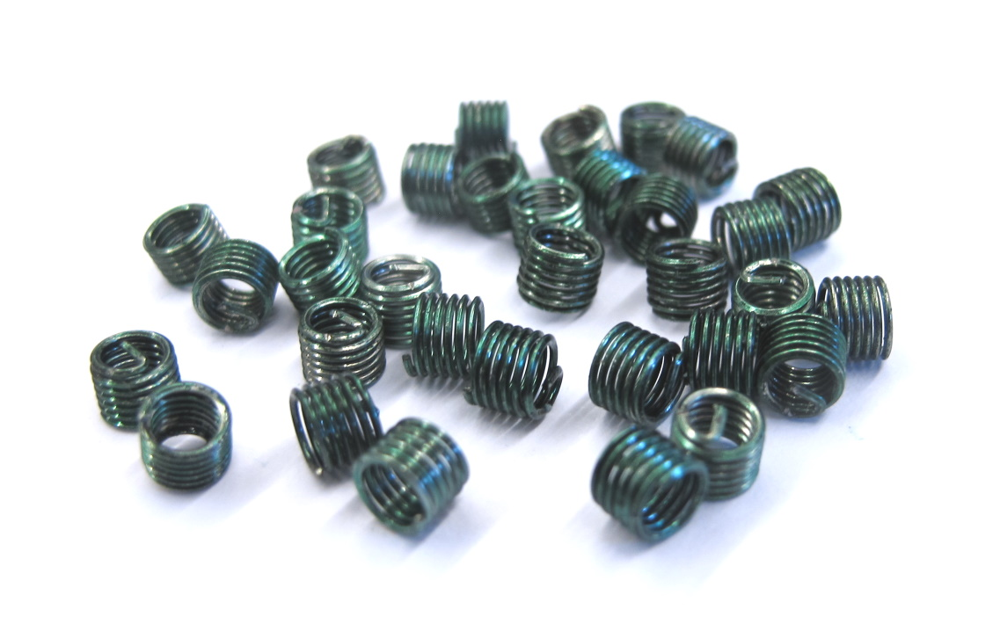  
* M3 x 4,5 Helicoil thread inserts
* Ordering information [below](#bill-of-materials---quadruped-robot-12dof)

### Vicon Markers
  *Reflective Markers for motion capture system - weight: 1g each*
* 9.5mm Vicon Markers
* M4 x 10 set screws for attachment
* Ordering information [below](#bill-of-materials---quadruped-robot-12dof)

## Bill of Materials - Quadruped Robot 12dof
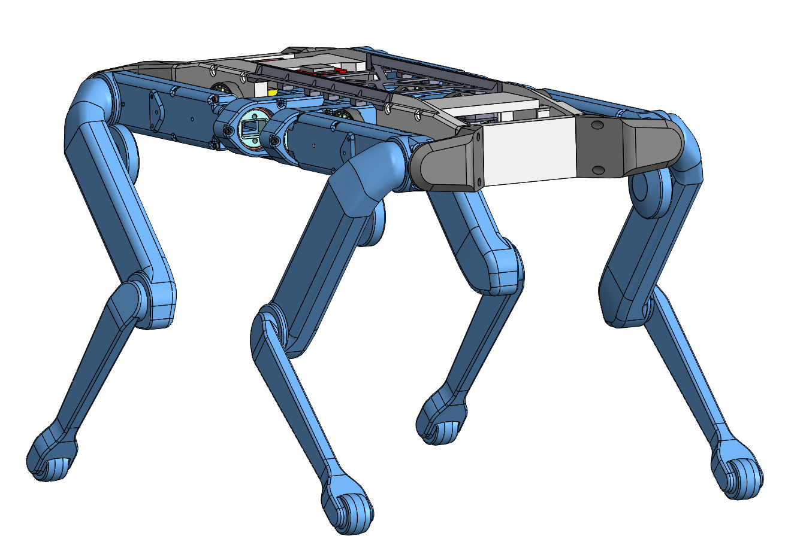

| Part Name | Quantity | Ordering Information | Comments |  
| --- | --- | --- | --- |   
|3DOF Leg |4|[3DOF Leg Documentation](../leg_3dof_v1/README.md#leg-3dof-v1)|Custom assembly|
| Master Board v2 | 1 | [Master Board Documentation](https://github.com/open-dynamic-robot-initiative/master-board#master-board) | Custom electronics |
| Micro Driver Board v2 | 6 | [Micro Driver Documentation](../../electronics/micro_driver_electronics/README.md#micro-driver-electronics)| Custom electronics |
|Inertia Measurement Unit| 1 |[Lord Microstrain 3DM-CX5-25](https://www.microstrain.com/inertial/3dm-cx5-25)   [Distributors](https://www.microstrain.com/support/distributors)| Extended measurement range:  Gyro Rate: +/- 900 deg/sec. Accelerometer range: +/- 20G|
|Body Structure Back |1|[STL file](stl_files/body_structure_back.STL)|[3d printed part](../actuator_module_v1/details/details_3d_printed_parts.md#details-3d-printed-parts)|
|Body Structure Bottom |2|[STL file - Rev A](stl_files/body_structure_bottom_rev_a.STL)|[3d printed part](../actuator_module_v1/details/details_3d_printed_parts.md#details-3d-printed-parts)|
|Body Structure Center |1|[STL file](stl_files/body_structure_center.STL)|[3d printed part](../actuator_module_v1/details/details_3d_printed_parts.md#details-3d-printed-parts)|
|Body Structure Center Handle|1|[STL file](stl_files/body_structure_center_handle.STL)|[3d printed part](../actuator_module_v1/details/details_3d_printed_parts.md#details-3d-printed-parts)|
|Body Structure Center Vicon|1|[STL file](stl_files/body_structure_center_vicon.STL)|[3d printed part](../actuator_module_v1/details/details_3d_printed_parts.md#details-3d-printed-parts)|
|Body Structure Front |1|[STL file](stl_files/body_structure_front.STL)|[3d printed part](../actuator_module_v1/details/details_3d_printed_parts.md#details-3d-printed-parts)|
|Body Structure Hip AA Support |4|[STL file](stl_files/body_structure_hip_aa_support.STL)|[3d printed part](../actuator_module_v1/details/details_3d_printed_parts.md#details-3d-printed-parts)|
|Body Structure Side |4|[STL file](stl_files/body_structure_side.STL)|[3d printed part](../actuator_module_v1/details/details_3d_printed_parts.md#details-3d-printed-parts)|
|Body Structure Top IMU |1|[STL file](stl_files/body_structure_top_imu.STL)|[3d printed part](../actuator_module_v1/details/details_3d_printed_parts.md#details-3d-printed-parts)|
|Body Structure Top Master Board |1|[STL file](stl_files/body_structure_top_master_board.STL)|[3d printed part](../actuator_module_v1/details/details_3d_printed_parts.md#details-3d-printed-parts)|
|Led Cover |1|[STL file](stl_files/led_cover.STL)|[3d printed part](../actuator_module_v1/details/details_3d_printed_parts.md#details-3d-printed-parts) Print with transparent or translucent material.|
|Hip Adapter|2|[STL file](stl_files/hip_adapter.STL)|[3d printed part](../actuator_module_v1/details/details_3d_printed_parts.md#details-3d-printed-parts)|
|Spacer Micro Driver Stack|16|[STL file](stl_files/spacer_micro_driver_stack.STL)|[3d printed part](../actuator_module_v1/details/details_3d_printed_parts.md#details-3d-printed-parts)|
|Hip AA Bearing 25mm x 20mm x 4mm   ET2520 2Z VA| 4 | [Emiliana Cuscinetti](https://www.emilianacuscinetti.com/en/miniature-bearings/) [Doppiaemme](https://www.doppiaemme.it/en/prodotti/) [EZO USA](https://catalog.ezo-usa.com/category/metric-series-bearings) [SBN](https://www.sbn.de/en/)|Italy: [Emiliana Cuscinetti](https://www.emilianacuscinetti.com/en/miniature-bearings/) or [Doppiaemme](https://www.doppiaemme.it/en/prodotti/)  USA: [EZO USA](https://catalog.ezo-usa.com/category/metric-series-bearings)  All other countries: Send an email to info@sbn.de and ask for a quote - they ship worldwide.   SBN # C07024  We use stainless steel bearings.|
|Fasteners Body Structure Side M3x12 Socket Head Cap Screw|16|[Online Schrauben](https://online-schrauben.de/shop/Schrauben/Innensechskantschrauben/ISO-4762-DIN-912-Zylinderkopfschrauben-mit-Innensechskant-aehnl.-DIN-912/Edelstahl-Rostfrei-A2/M-3-Gewinde-M-metrisches-Regelgewinde)|Stainless steel. Online Schrauben ships within Europe.|
|Fasteners Body Structure Center M3x8 Socket Head Cap Screw|8|[Online Schrauben](https://online-schrauben.de/shop/Schrauben/Innensechskantschrauben/ISO-4762-DIN-912-Zylinderkopfschrauben-mit-Innensechskant-aehnl.-DIN-912/Edelstahl-Rostfrei-A2/M-3-Gewinde-M-metrisches-Regelgewinde)|Stainless steel. Online Schrauben ships within Europe.|
|Fasteners Hip AA Actuator Modules M2,5x10 Socket Head Cap Screw|16|[Online Schrauben](https://online-schrauben.de/shop/Schrauben/Innensechskantschrauben/ISO-4762-DIN-912-Zylinderkopfschrauben-mit-Innensechskant-aehnl.-DIN-912/Edelstahl-Rostfrei-A2/M-2,5-Gewinde-M-metrisches-Regelgewinde)|Stainless steel. Online Schrauben ships within Europe.|
|Fasteners Hip AA Support M3x14 Socket Head Cap Screw|8|[Online Schrauben](https://online-schrauben.de/shop/Schrauben/Innensechskantschrauben/ISO-4762-DIN-912-Zylinderkopfschrauben-mit-Innensechskant-aehnl.-DIN-912/Edelstahl-Rostfrei-A2/M-3-Gewinde-M-metrisches-Regelgewinde)|Stainless steel. Online Schrauben ships within Europe.|
|Fasteners Micro Driver Stack M2,5x25 Socket Head Cap Screw|8|[Online Schrauben](https://online-schrauben.de/shop/Schrauben/Innensechskantschrauben/ISO-4762-DIN-912-Zylinderkopfschrauben-mit-Innensechskant-aehnl.-DIN-912/Edelstahl-Rostfrei-A2/M-2,5-Gewinde-M-metrisches-Regelgewinde)|Stainless steel. Online Schrauben ships within Europe.|
|Fasteners IMU|3|M2,5x16 Slotted Screw Conrad 839940-62|Polyamide Plastic Shorten to 13mm|
|Helicoil M3 x 4,5mm|32|[RS 470-838](https://de.rs-online.com/web/p/reparatur-einsatzgewinde/0470838/) [Hoffmann 082812 M3](https://www.hoffmann-group.com/GB/en/houk/Power-tools-and-workshop-supplies/Soldering-tools-cleaning-devices-thread-repair/Thread-insert-set%2C-10-or-20-pieces-1-5×D/p/082812-M3?tId=438)|1,5xD Böllhoff 41890030045|
|Vicon Markers Ø 9,5mm | 13 |[Vicon Distributors](https://www.vicon.com/contact/)|Reflective Vicon Marker, solid, on plastic foot, Ø 9,5mm|
|Fasteners Vicon Markers M4x10 Set Screw | 13 |[Online Schrauben](https://online-schrauben.de/shop/Schrauben/Innensechskantschrauben/DIN-913-Gewindestifte-mit-Innensechskant-und-Kegelkuppe-aehnl.-ISO-4026/Edelstahl-Rostfrei-A2/M-4-Gewinde-M-metrisches-Gewinde)|Stainless steel. Online Schrauben ships within Europe.|

## Preparing the 3d printed parts
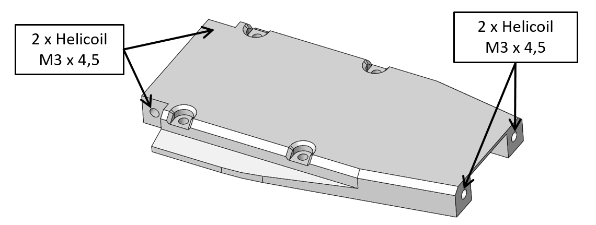  

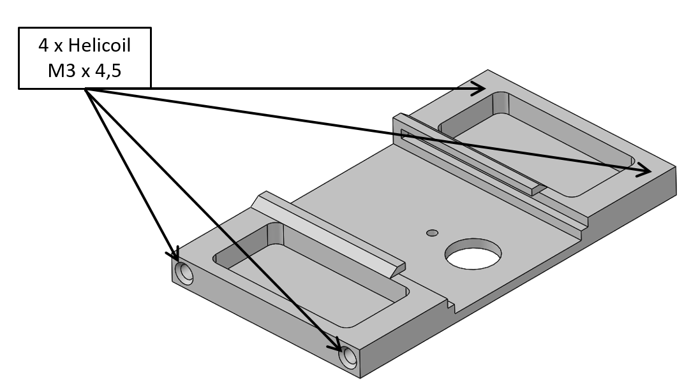  

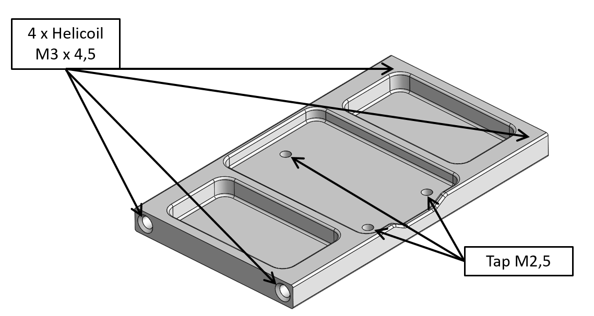  

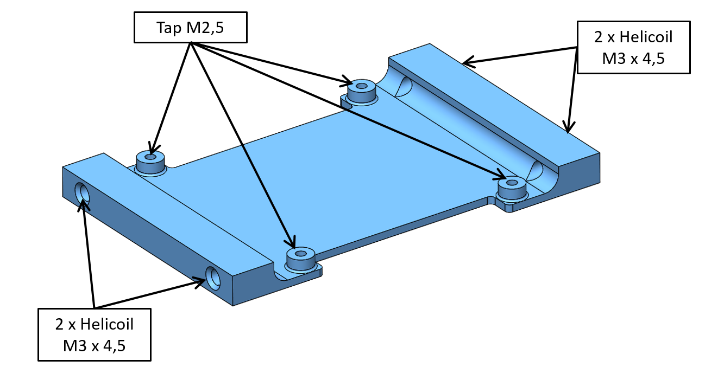  

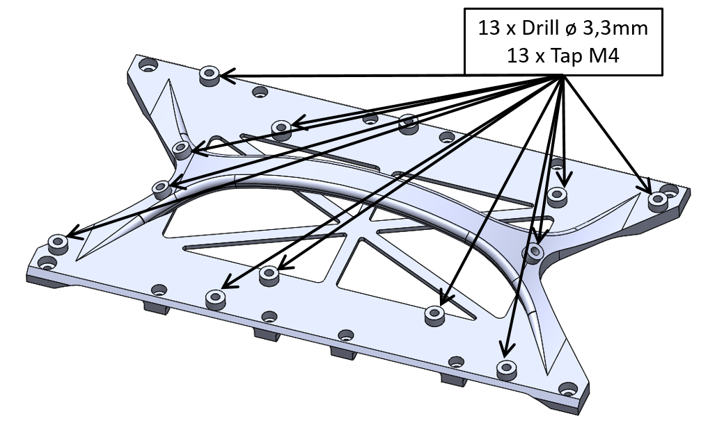  

## Quadruped Robot Wiring Details

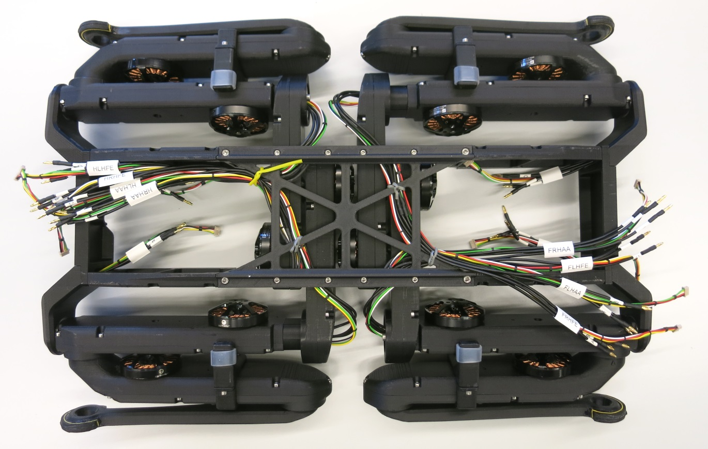 *Wiring Quadruped Robot - Bottom View* 

* The wiring of the robot is described on a separate page: [Details Electronics 12dof Quadruped](details/details_electronics_quadruped_12dof.md#details-electronics-quadruped-robot-12dof-v1)

## Micro Driver Stack Motor Assignment
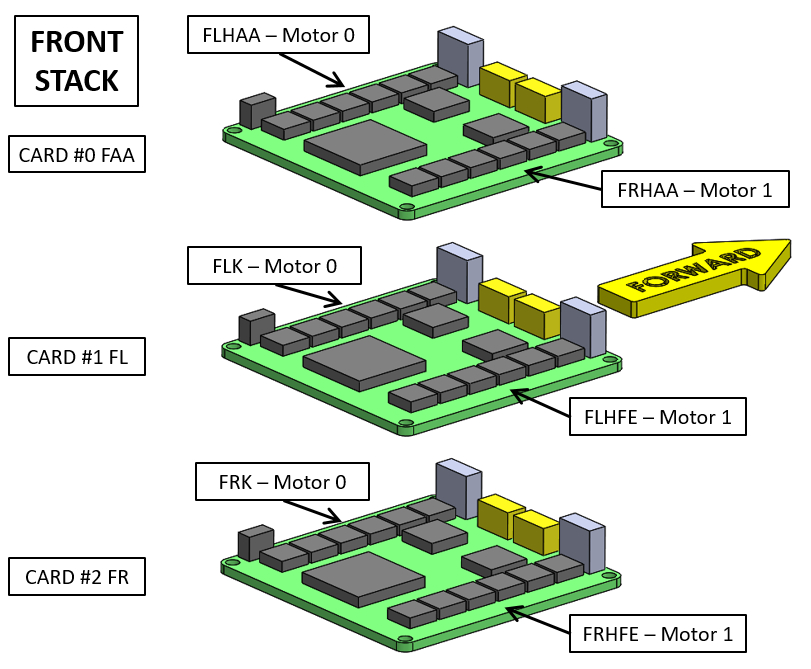   

---
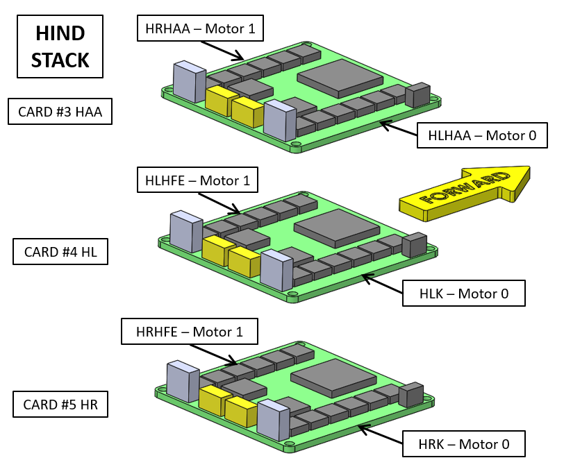   

| Joint ID | Joint Name | Motor Driver Card | Motor Port |Motor Index |
| --- | --- | --- | --- | ---|
|0|FL_HAA|0|0|0|
|1|FL_HFE|1|1|3|
|2|FL_K|1|0|2|
|3|FR_HAA|0|1|1|
|4|FR_HFE|2|1|5|
|5|FR_K|2|0|4|
|6|HL_HAA|3|0|6|
|7|HL_HFE|4|1|9|
|8|HL_K|4|0|8|
|9|HR_HAA|3|1|7|
|10|HR_HFE|5|1|11|
|11|HR_K|5|0|10|

## Vicon Object
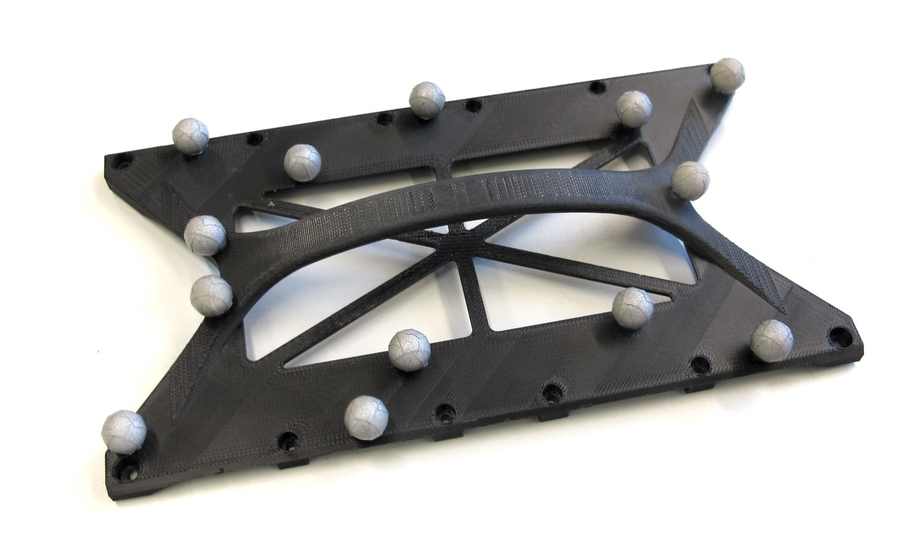  *Body Structure Center Plate with Vicon Markers - weight: 43g*  

* You can use this Vicon object for base state estimation
* It can be installed instead of the Body Structure Center Plate
* You can download the Vicon Object here: [Solo12 Vicon Object](details/vicon_object_quadruped_12dof.zip)

<a href="details/solo_12_body_structure_center_vicon.PDF">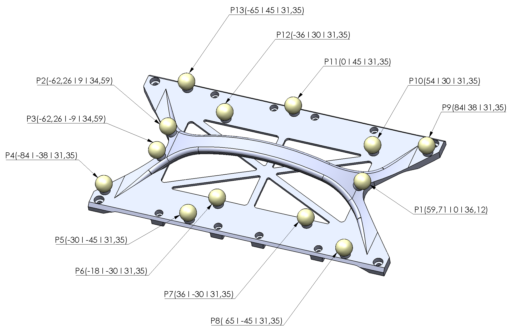</a> *Click on picture above to view the PDF drawing*

## Robot Coordinate System Origin
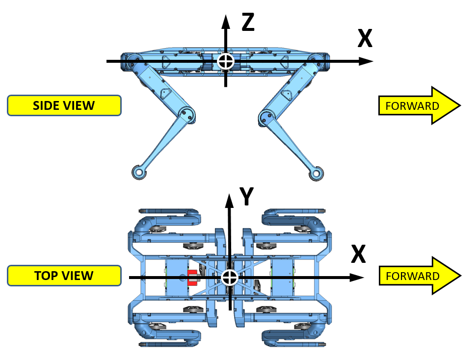  

* more information about the conventions that we use for our robots: [Conventions](../general/conventions.md#conventions)

## Inertial Sensor Origin Position
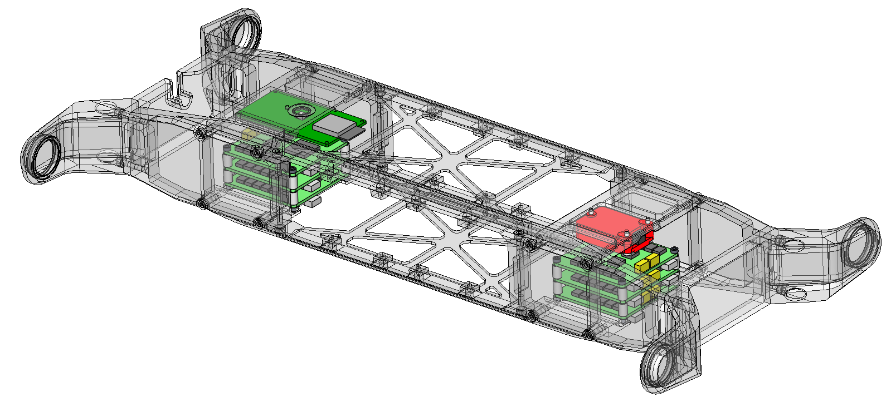 *IMU Mounting Position - the IMU is colored red in the screenshot above.* 

* the IMU is mounted in the front of the robot
* the label on the IMU is pointing downwards (see picture below)
* the coordinate systems of the IMU and the Quadruped Robot have the same orientation - more information here: [Coordinate System Conventions](../general/conventions.md#conventions)
* the offset between the coordinate systems is documented below
* the IMU origin is **not** in the geometrical center of the IMU
* [IMU Technical Drawing - see Page 2](https://s3.amazonaws.com/download.microstrain.com/Drawings/3065-0291-ICD.pdf)

|IMU Origin Position in the Robot Coordinate System| X | Y | Z |  
| --- | --- | --- | --- |
||104,07mm|-6,35mm|15,40mm|

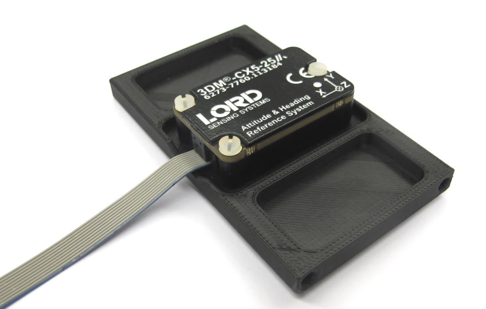 

## Simplified 3D Model

The simplified STL files for visualization and simulation can be found here: [STL Files Visualization](stl_files_for_visualization)

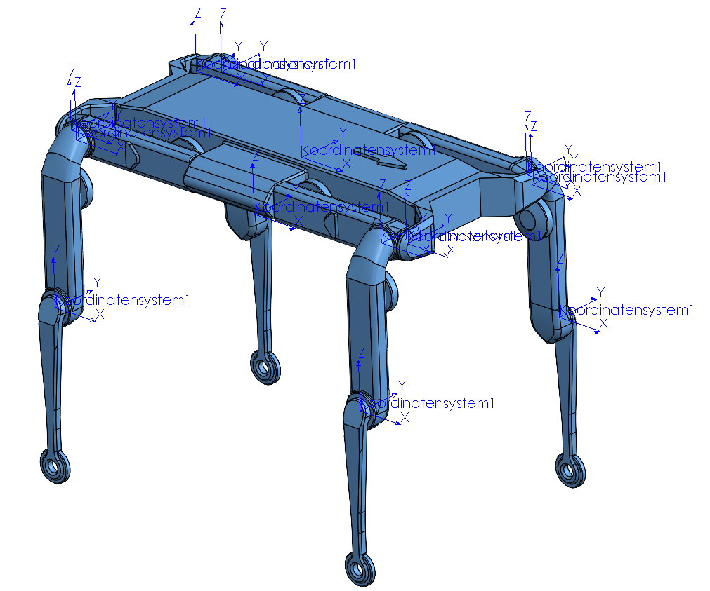

<a href="details/solo12_visualization_model.PDF">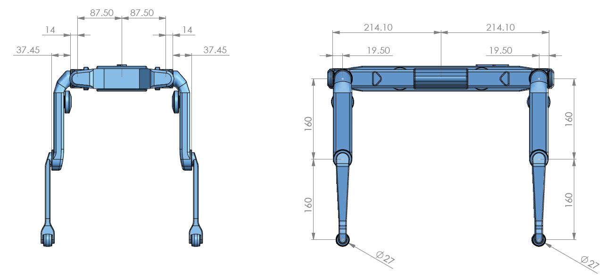</a> *Click on picture above to view the PDF drawing*

## Inertia Parameters for Simulation

## Robot Stand

## Robot Calibration

* [Details Quadruped 12dof Calibration Tool](../general/robot_calibration.md#calibration-tool-quadruped-12dof)

## View the quadruped cad model in your web browser
 

<a href="https://open-dynamic-robot-initiative.github.io/cad_files/quadruped_12dof">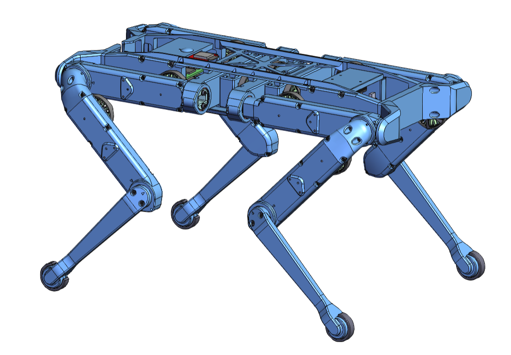</a> *Quadruped Robot 12dof standing - Click on picture to view the cad model in your browser*

 *Quadruped Robot 12dof sitting - Click on picture to view the cad model in your browser*

<a href="https://open-dynamic-robot-initiative.github.io/cad_files/quadruped_12dof_body_structure">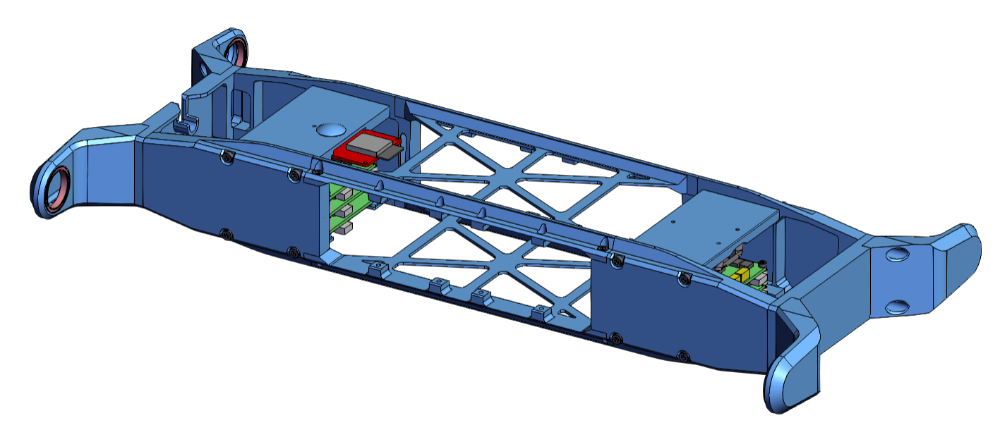</a> *Quadruped Robot 12dof Body Structure - Click on picture to view the cad model in your browser*

## CAD Files

The Solidworks CAD files are available here: [Quadruped 12dof v1 Solidworks CAD files](solidworks_files/quadruped_12dof_v1.zip)

## More Information
[Open Dynamic Robot Initiative - Webpage](https://open-dynamic-robot-initiative.github.io)  
[Open Dynamic Robot Initiative - YouTube Channel](https://www.youtube.com/channel/UCx32JW2oIrax47Gjq8zNI-w)   
[Open Dynamic Robot Initiative - Forum](https://odri.discourse.group/categories)  
[Open Dynamic Robot Initiative - Paper](https://arxiv.org/pdf/1910.00093.pdf)  
[Hardware Overview](../../README.md#open-robot-actuator-hardware)  
[Software Overview](https://github.com/open-dynamic-robot-initiative/open-dynamic-robot-initiative.github.io/wiki)  

## Authors
Felix Grimminger

## License
BSD 3-Clause License

## Copyright
Copyright (c) 2019-2021, Max Planck Gesellschaft and New York University
