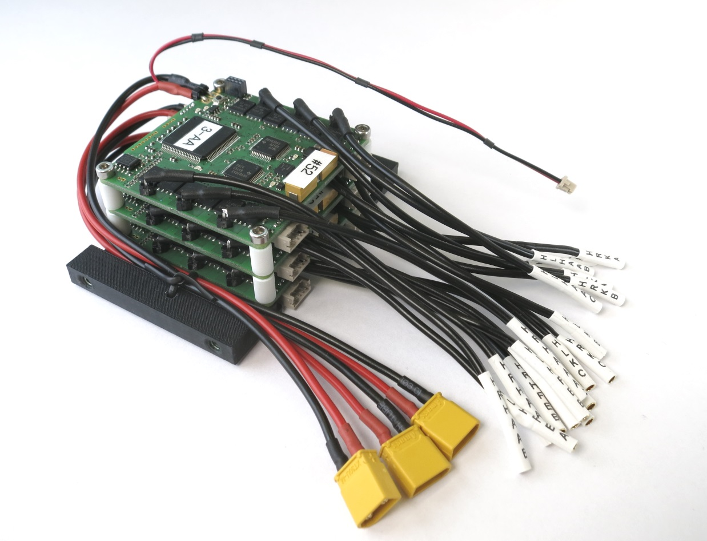
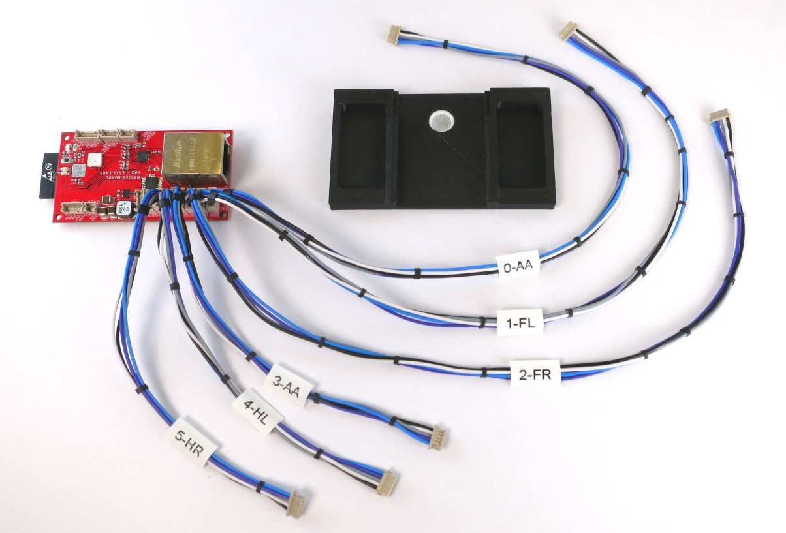
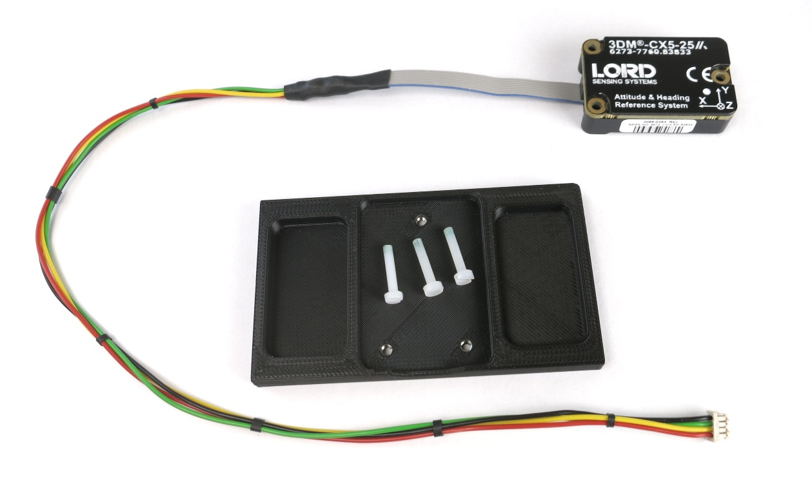
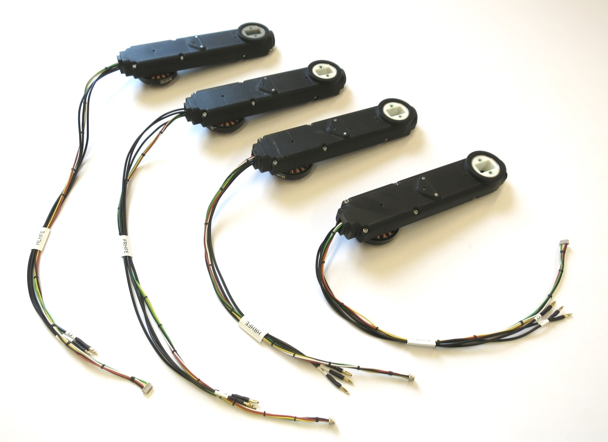
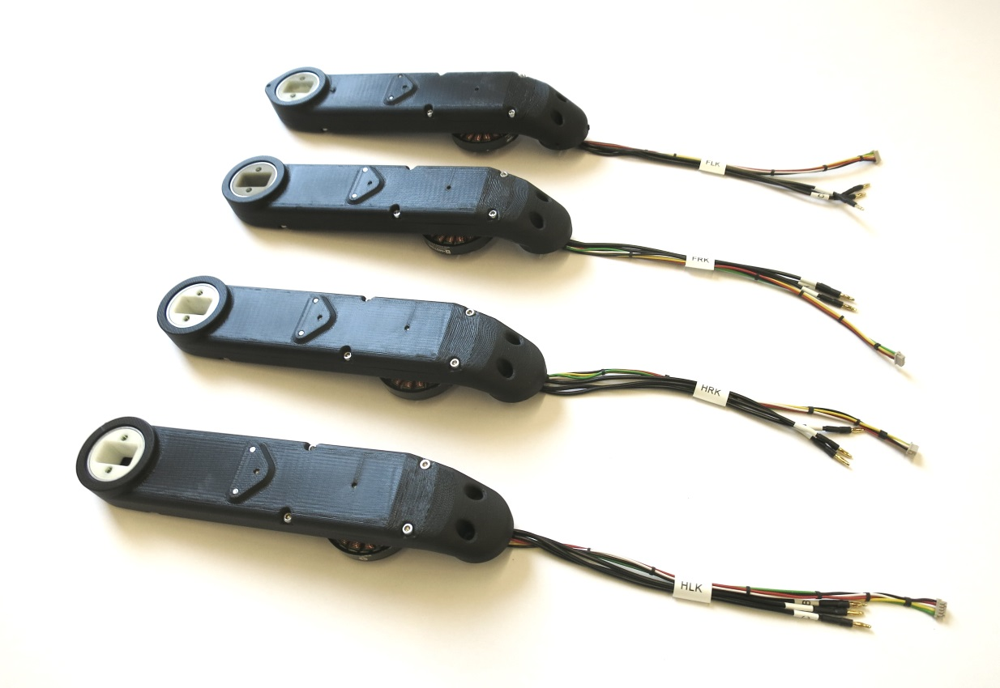
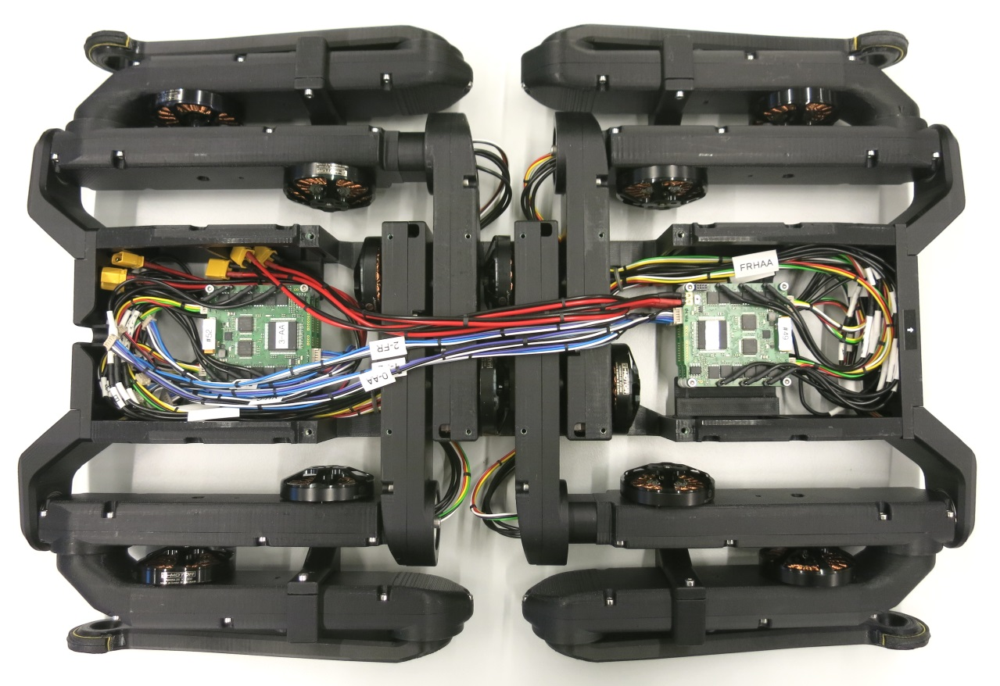
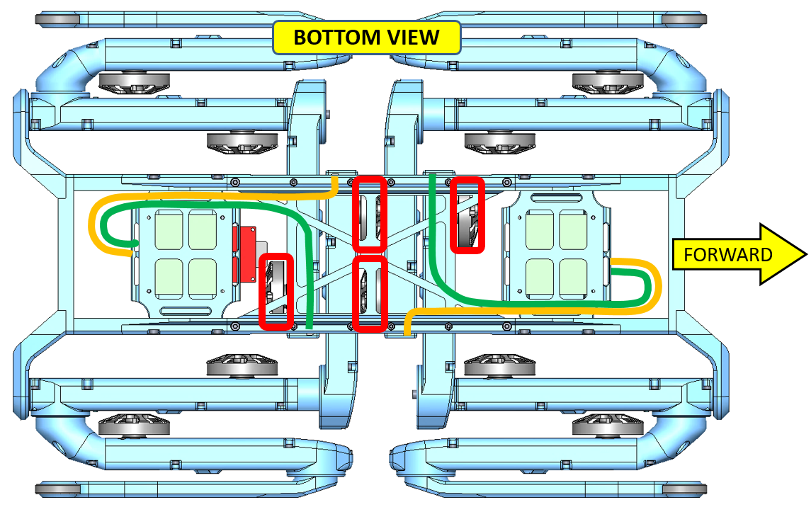
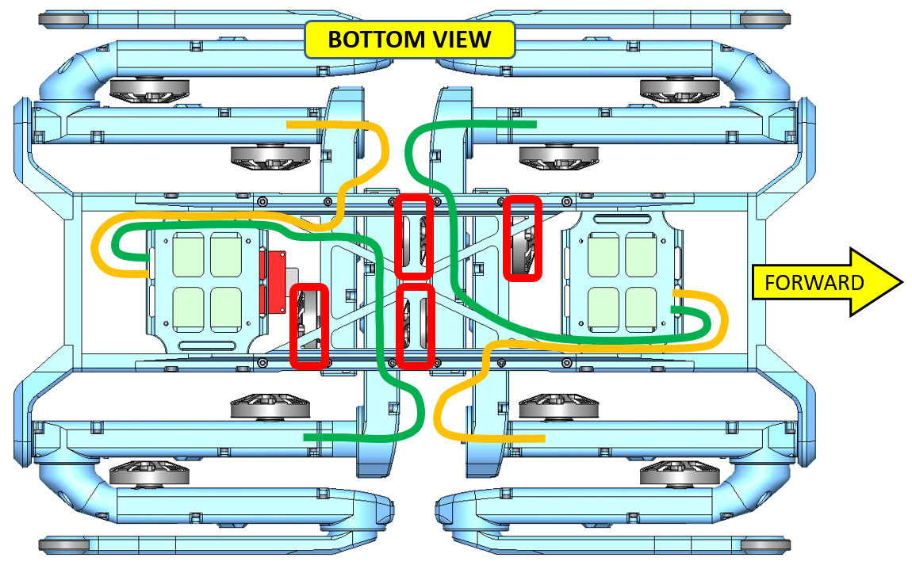
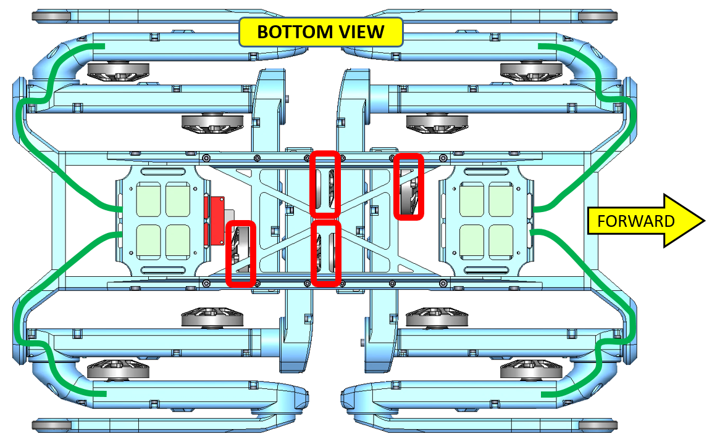
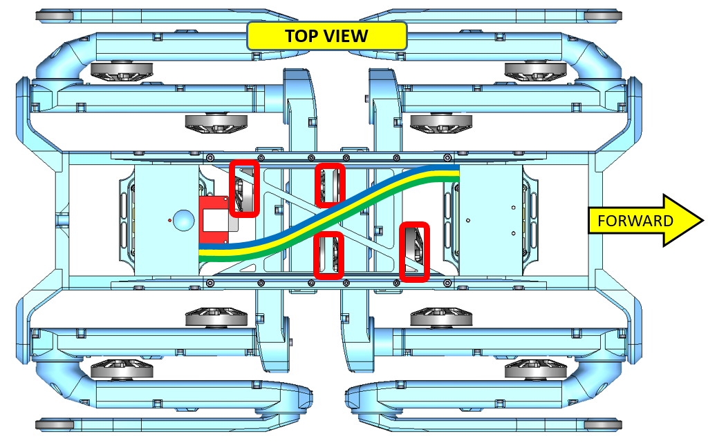

# Details Electronics Quadruped Robot 12dof v1
 *12dof robot - electronic component overview - weight 264g*  

## Description
* electronics for 12 degree of freedom robot
* motor driver stack front
* motor driver stack back
* master board
* inertia measurement unit

### Micro Driver Stack Front
 *Micro driver stack front fully wired - weight: 94g*  

| Description | Quantity | Wire Length | Comments |  
| --- | --- | --- | --- |   
|Motor Phase Wires |18|8cm||
|Power Supply Wires|3|?cm||

---
### Micro Driver Stack Back
 *Micro driver stack back fully wired - weight: 90g*  

| Description | Quantity | Wire Length | Comments |  
| --- | --- | --- | --- |   
|Motor Phase Wires |18|8cm||
|Power Supply Wires|3|?cm||
|Master Board Supply Wire|1|?cm||

---
### Master Board
 *Master board with spi wires and mounting plate - weight: 50g*  

 *SPI wires*  

| Description | Quantity | Wire Length | Comments |  
| --- | --- | --- | --- |   
|SPI wires micro driver stack front|3|30cm|0-AA / 1-FL / 2-FR|
|SPI wires micro driver stack back|3|14cm|3-AA / 4-HL / 5-HR|

---
### Interita Measurement Unit
 *IMU with wire and mounting plate - weight: 30g*  

| Description | Quantity | Wire Length | Comments |  
| --- | --- | --- | --- |   
|IMU wire |1|35cm||

---

### Hip AA Actuator Modules
 *Hip AA Actuator Modules - weight: 149g each*  

| Description | Quantity | Wire Length | Comments |  
| --- | --- | --- | --- |   
|Front Right Hip AA Motor Phases |3|21cm|FRHAA|
|Front Right Hip AA Encoder Wire |1|26cm|FRHAA|
|Front Left Hip AA Motor Phases |3|23cm|FLHAA|
|Front Left Left AA Encoder Wire |1|27cm|FLHAA|
|Hind Right Hip AA Motor Phases |3|22cm|HRHAA|
|Hind Right Hip AA Encoder Wire |1|29cm|HRHAA|
|Hind Left Hip AA Motor Phases |3|20cm|HLHAA|
|Hind Left Hip AA Encoder Wire |1|25cm|HLHAA|

### Hip FE Actuator Modules
 *Hip FE Actuator Modules - weight: 157g each*  

| Description | Quantity | Wire Length | Comments |  
| --- | --- | --- | --- |   
|Front Right Hip FE Motor Phases |3|35cm|FRHFE|
|Front Right Hip FE Encoder Wire |1|41cm|FRHFE|
|Front Left Hip FE Motor Phases |3|27cm|FLHFE|
|Front Left Left FE Encoder Wire |1|33cm|FLHFE|
|Hind Right Hip FE Motor Phases |3|26cm|HRHFE|
|Hind Right Hip FE Encoder Wire |1|31cm|HRHFE|
|Hind Left Hip FE Motor Phases |3|34cm|HLHFE|
|Hind Left Hip FE Encoder Wire |1|40cm|HLHFE|

### Upper Leg Actuator Modules
 *Upper Leg Actuator Modules - weight: 152g each*  

| Description | Quantity | Wire Length | Comments |  
| --- | --- | --- | --- |   
|Front Right Knee Motor Phases |3|17cm|FRK|
|Front Right Knee Encoder Wire |1|20cm|FRK|
|Front Left Knee Motor Phases |3|17cm|FLK|
|Front Left Knee Encoder Wire |1|20cm|FLK|
|Hind Right Knee Motor Phases |3|17cm|HRK|
|Hind Right Knee Encoder Wire |1|20cm|HRK|
|Hind Left Knee Motor Phases |3|17cm|HLK|
|Hind Left Knee Encoder Wire |1|20cm|HLK|

## Wire Routing

 *Bottom view - all the motor module wires are routet on the bottom of the robot. Details below.*

 *Top view - the power, imu and spi wires are routed on the top of the robot. Details below*

### Wire Routing Hip AA Modules
 *Keep the wires away from the motor rotors.  The rotors are marked with red boxes in the picture above.*  

### Wire Routing Hip FE Modules
 *Keep the wires away from the motor rotors.  The rotors are marked with red boxes in the picture above.*  

### Wire Routing Upper Leg Modules
 *Keep the wires away from the motor rotors.  The rotors are marked with red boxes in the picture above.*  

### Wire Routing Power, SPI and IMU
 *Keep the wires away from the motor rotors.  The rotors are marked with red boxes in the picture above.*

## View the biped cad model in your web browser
 

 *Quadruped robot 12dof standing - Click on picture to view the cad model in your browser*

 *Quadruped robot 12dof folded - Click on picture to view the cad model in your browser*

## Authors
Felix Grimminger

## License
BSD 3-Clause License

## Copyright
Copyright (c) 2019-2020, Max Planck Gesellschaft and New York University

## More Information
[Open Dynamic Robot Initiative - Webpage](https://open-dynamic-robot-initiative.github.io)  
[Open Dynamic Robot Initiative - YouTube Channel](https://www.youtube.com/channel/UCx32JW2oIrax47Gjq8zNI-w)   
[Open Dynamic Robot Initiative - Forum](https://odri.discourse.group/categories)  
[Open Dynamic Robot Initiative - Paper](https://arxiv.org/pdf/1910.00093.pdf)  
[Hardware Overview](../../README.md#open-robot-actuator-hardware)  
[Software Overview](https://github.com/open-dynamic-robot-initiative/open-dynamic-robot-initiative.github.io/wiki)
