# Quadruped Robot 8dof v2

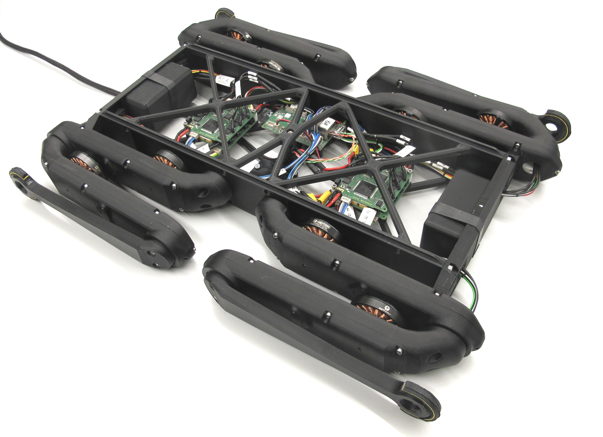 *Quadruped Robot 8dof v2 - weight 1,9kg*  

## Description
* weight reduced body frame structure and new electronics
* 8dof - 8 degree of freedom robot
* Power and communication over wire (24V / Ethernet)
* Master board, micro drivers and inertia measurement unit
* Robot weight 1,7kg
* We are adding 200g weights as placeholder for batteries
* Weight 1,9kg with 200g battery placeholders

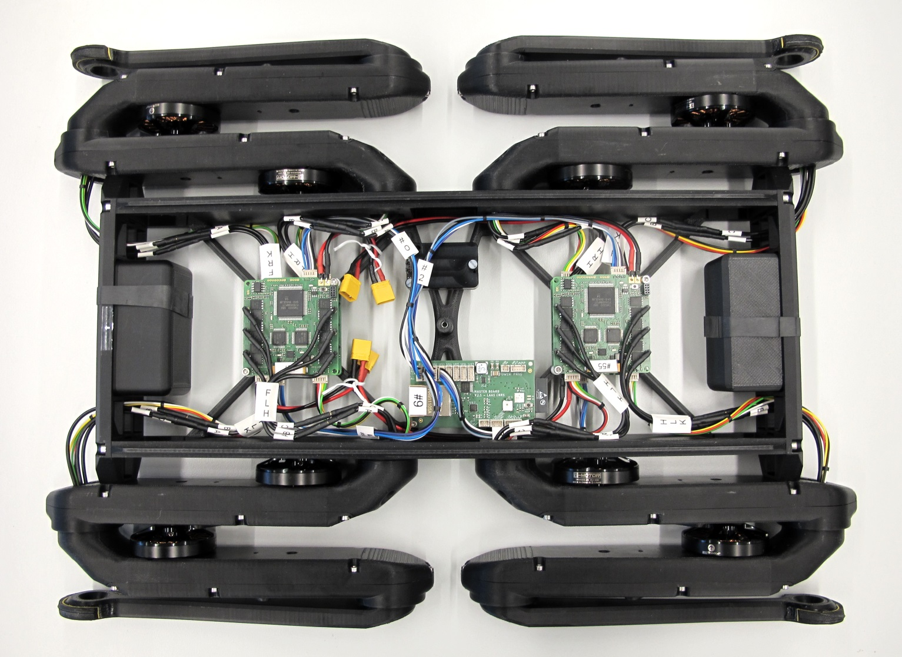 *Quadruped robot without top structure*  

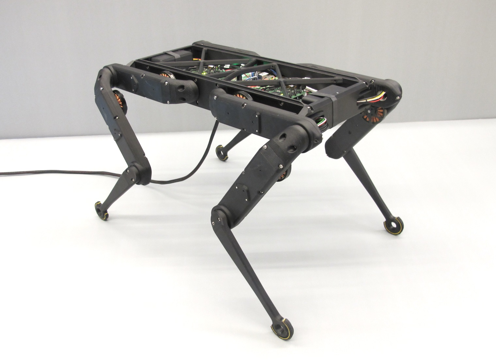 *Quadruped robot standing*

---
## Electronics
### Master Board
   *Master board v2 - weight: 19g*
* Custom electronics board -> [Master Board Documentation](https://github.com/open-dynamic-robot-initiative/master-board#master-board)
---
### Micro Driver
   *Micro Driver v2 - Stack with 3 cards - weight: 41g*

* Custom electronics board -> [Micro Driver Board Documentation](../../electronics/micro_driver_electronics/README.md)
---
### Inertia Measurement Unit
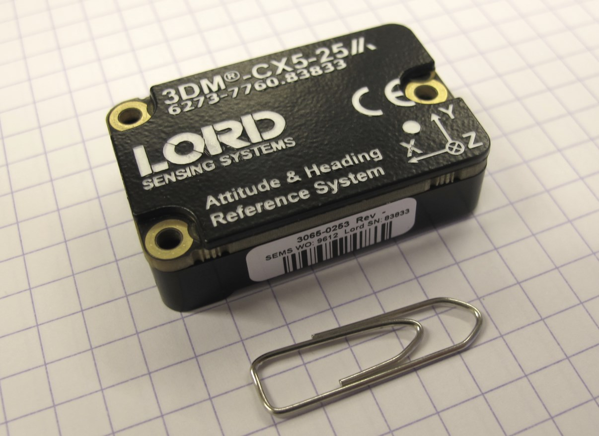  
* Lord Microstrain 3DM-CX5-25
* Weight: 13g
* [Lord Microstrain webpage](https://www.microstrain.com/inertial/3dm-cx5-25)
* We use the imu with an extended measurement range
  * Gyro Rate: +/- 900 deg/sec.
  * Accelerometer range: +/- 20G
---
## 3D Printed Parts
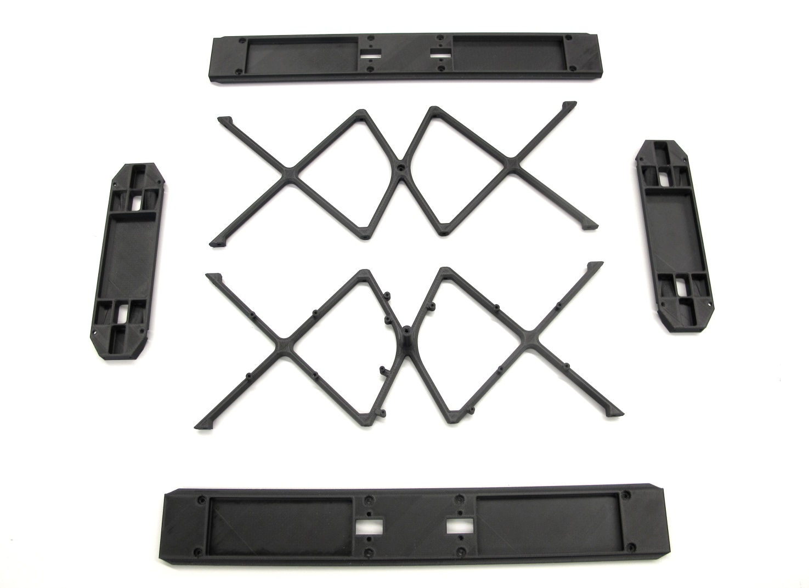 *Body structure part overview - the weight of the parts in the picture is 226g.*  

* All the STL files for 3d printing the body structure can be found here: [STL Files Body Structure](stl_files).  

`The recommended printing direction for all the parts below is the positive z direction of the stl file.`

---
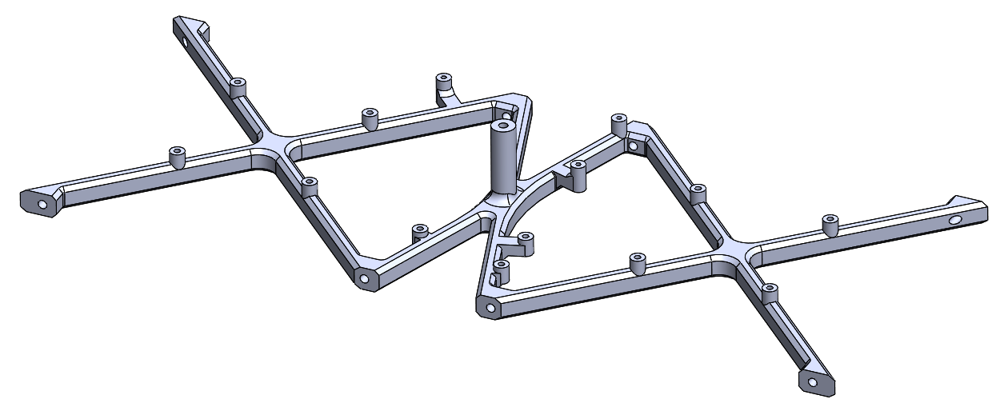  
* [Body Structure Bottom - STL file](stl_files/body_structure_bottom.STL) 
* weight: 38g
---
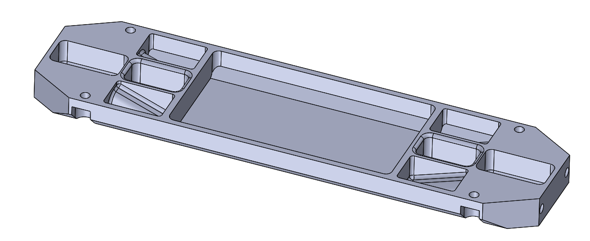  
* [Body Structure Front - STL file](stl_files/body_structure_front.STL) 
* weight: 24g
* the front and back plates of the body are identical
---
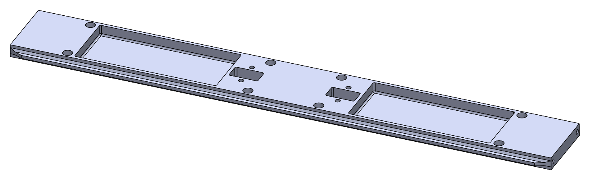  
* [Body Structure Side - STL file](stl_files/body_structure_side.STL) 
* weight: 52g
* the left and right side body structures are identical
---
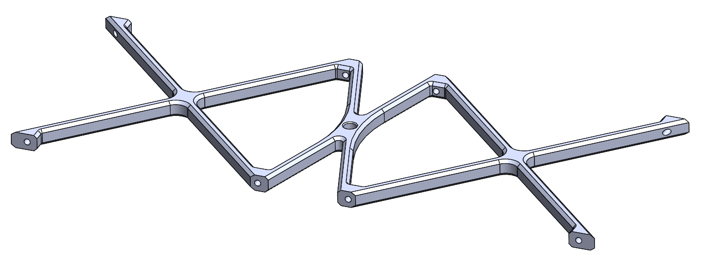  
* [Body Structure Top - STL file](stl_files/body_structure_top.STL) 
* weight: 35g
---
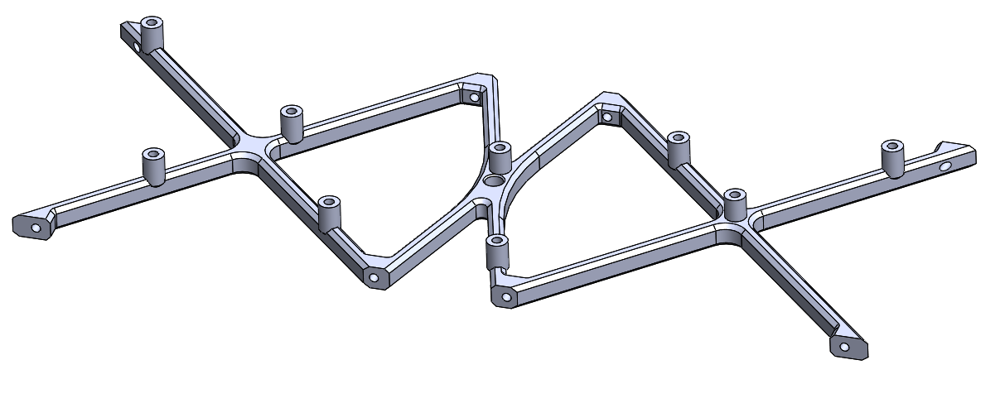  
* [Body Structure Top Vicon- STL file](stl_files/body_structure_top_vicon.STL) 
* weight: 37g
* attachment points for Vicon markers
---

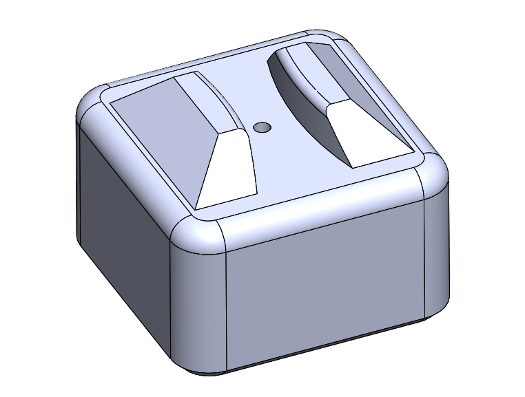  
* [Stand Adapter - STL file](stl_files/stand_adapter.STL) 
---

## Bill of Materials - Quadruped Robot 8dof v2
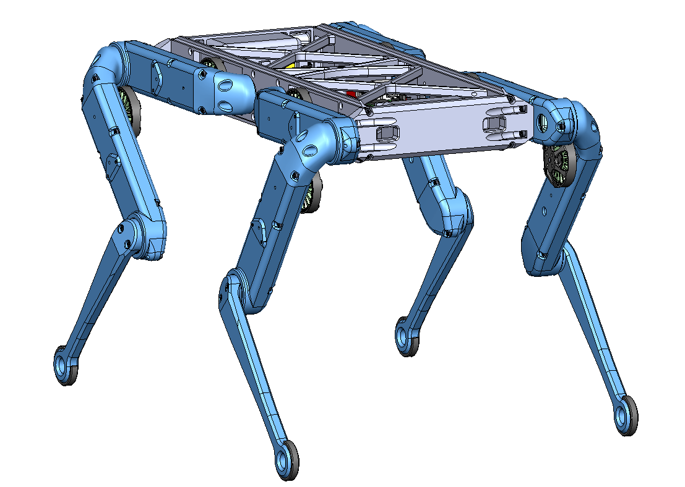

| Part Name | Quantity | Ordering Information | Comments |  
| --- | --- | --- | --- |   
|2DOF Leg |4|Custom assembly|[2DOF Leg Documentation](../leg_2dof_v2/README.md)|
|Body Structure Bottom |1|[STL file](stl_files/body_structure_bottom.STL)|3d printed part|
|Body Structure Front |2|[STL file](stl_files/body_structure_front.STL)|3d printed part The front and back plates are identical.|
|Body Structure Side |2|[STL file](stl_files/body_structure_side.STL)|3d printed part The left and right side plates are identical.|
|Body Structure Top |1|[STL file](stl_files/body_structure_top.STL)|3d printed part|
|Spacer Micro Driver Stack |8|[STL file](stl_files/spacer_micro_driver_stack.STL)|3d printed part|
|Stand Adapter |1|[STL file](stl_files/stand_adapter.STL)|3d printed part (optional)|
| Inertia Measurement Unit | 1 | Lord Microstrain  3DM-CX5-25| Extended measurement range  Gyro Rate: +/- 900 deg/sec. Accelerometer range: +/- 20G|
| Master Board v2 | 1 | [Master Board Documentation](https://github.com/open-dynamic-robot-initiative/master-board#master-board) | Custom Electronics |
| Micro Driver Board v2 | 4 | [Micro Driver Documentation](../../electronics/micro_driver_electronics/README.md)  | Custom electronics |
|Fasteners Body Structure |25|M3x8 Socket Head Cap Screw|Stainless steel|
|Fasteners Legs to Front Plate|8|M3x12 Socket Head Cap Screw|Stainless steel|
|Fasteners Micro Driver Electronics|8|M2,5x16 Socket Head Cap Screw|Stainless steel|
|Fasteners Master Board|3|M2x6 Socket Head Cap Screw|Stainless steel|
|Fasteners IMU|3|M2,5x16 Slotted Screw Conrad 839940-62|Polyamide Plastic|
|Helicoil Threaded Inserts|25|M3x4,5 Helicoil ||
Helicoil Threaded Inserts|8|M3x6 Helicoil ||

## Preparing the 3d printed parts

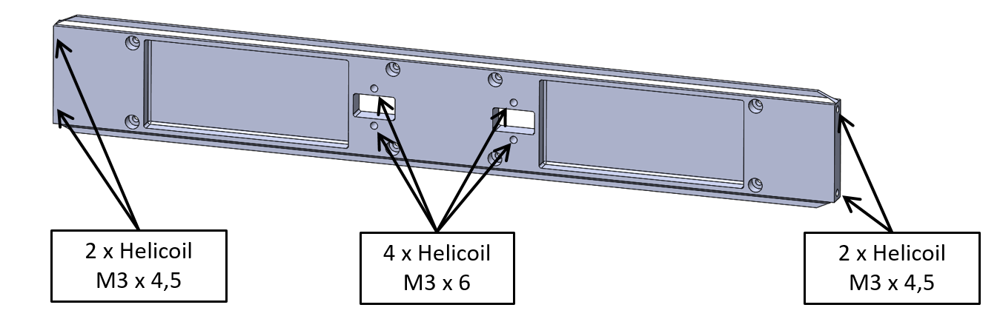 

---
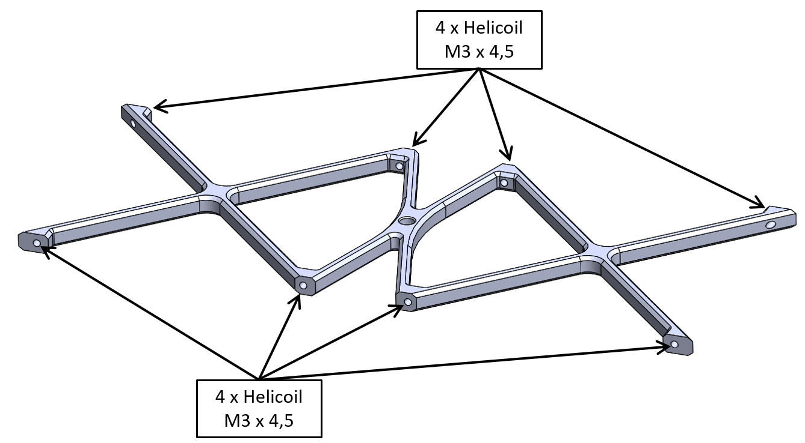 

---
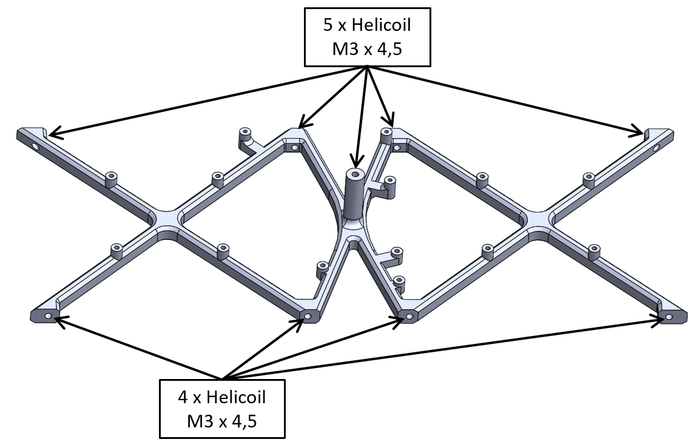 

---
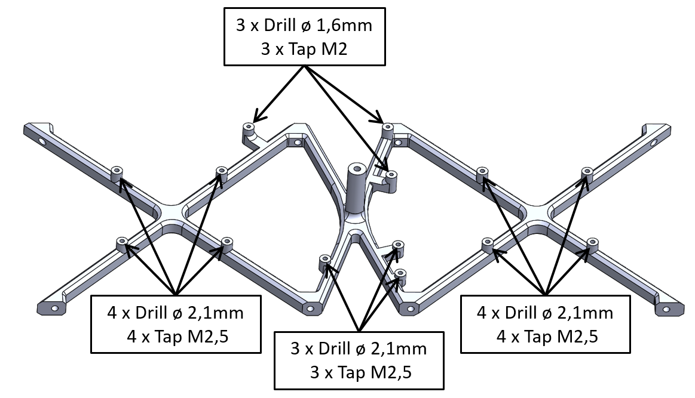 

---
## More Information
[Open Dynamic Robot Initiative - Webpage](https://open-dynamic-robot-initiative.github.io)  
[Open Dynamic Robot Initiative - YouTube Channel](https://www.youtube.com/channel/UCx32JW2oIrax47Gjq8zNI-w)   
[Open Dynamic Robot Initiative - Forum](https://odri.discourse.group/categories)  
[Open Dynamic Robot Initiative - Paper](https://arxiv.org/pdf/1910.00093.pdf)  
[Hardware Overview](../../README.md#open-robot-actuator-hardware)  
[Software Overview](https://github.com/open-dynamic-robot-initiative/open-dynamic-robot-initiative.github.io/wiki)  

---
## Authors
Felix Grimminger

## License
BSD 3-Clause License

## Copyright
Copyright (c) 2019-2020, Max Planck Gesellschaft and New York University
