# TriFingerEdu v1

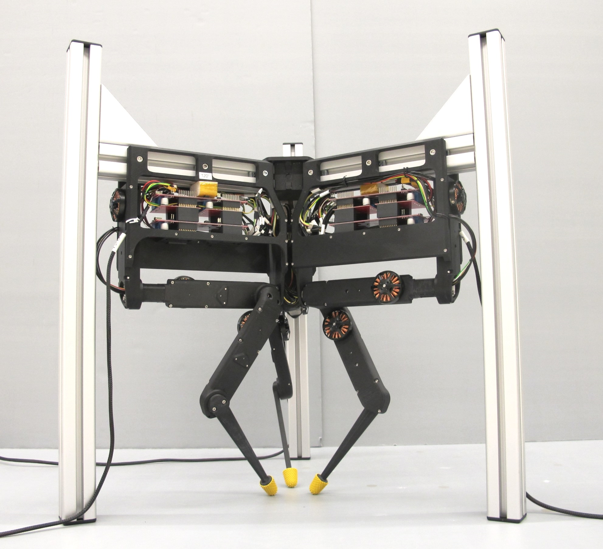 *TriFinger Manipulator Platform*

* the manipulator platform has 9 torque-controlled degrees of freedom
* it consists of 3 identical finger modules attached to an aluminum frame structure
* the finger module is describes in detail here: [Finger Module Page.](../finger_edu_v1/README.md)
* the frame an the required components are described below

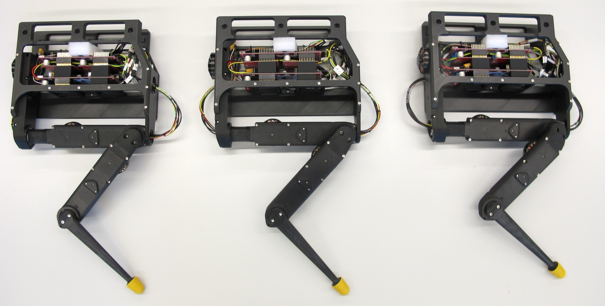   *Finger modules assembled - weight: 930g each*  

## Frame
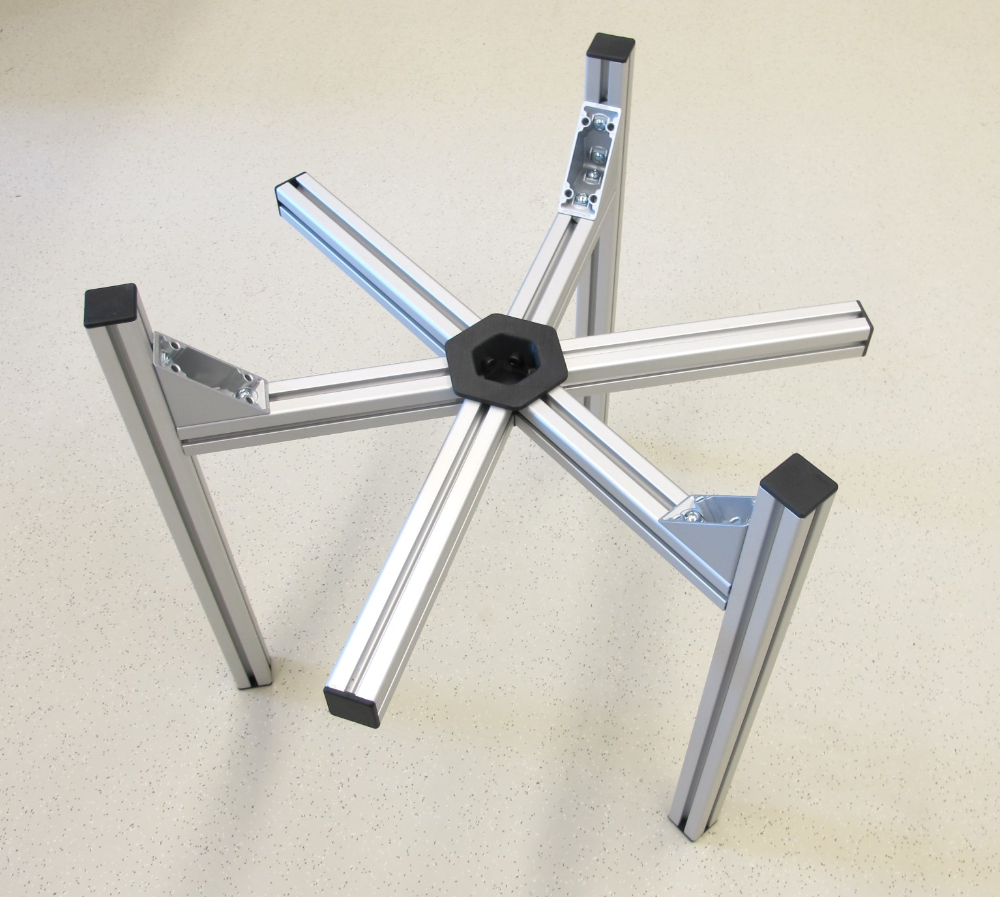   *Frame structure - t-slotted aluminum profiles*

* The frame structure consists of aluminum profiles from Item.   
* You will need the following components to build the frame.  

### Aluminum profiles
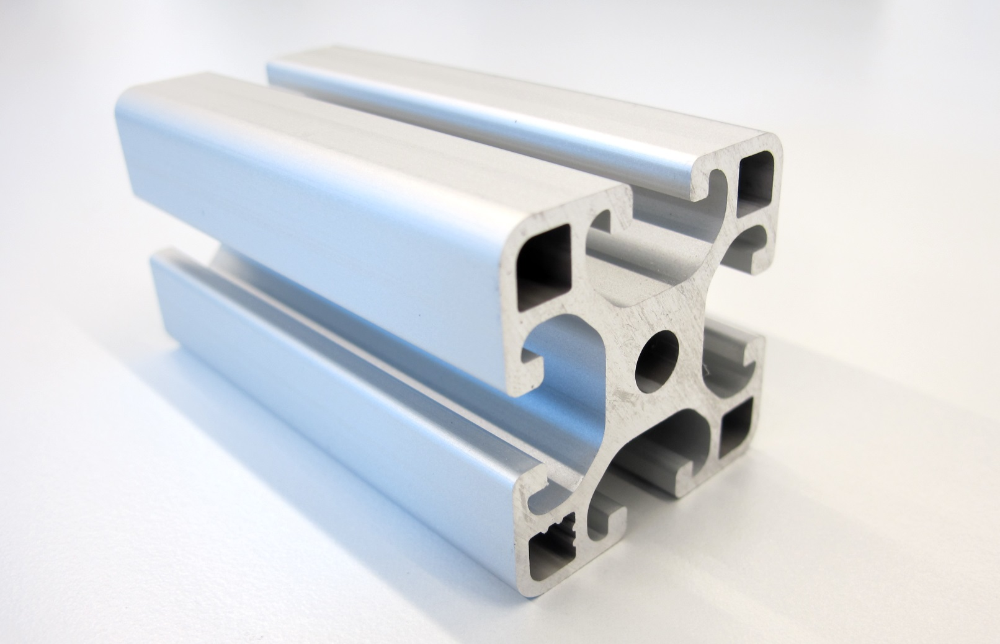   *Item Aluminum profile*
* Item aluminum profiles - Size 8 - 40mm x 40mm - Item part number: 0.0.026.33
* Cut the profiles to length according to [this drawing](details/aluminum_profiles.pdf).

### Angle brackets
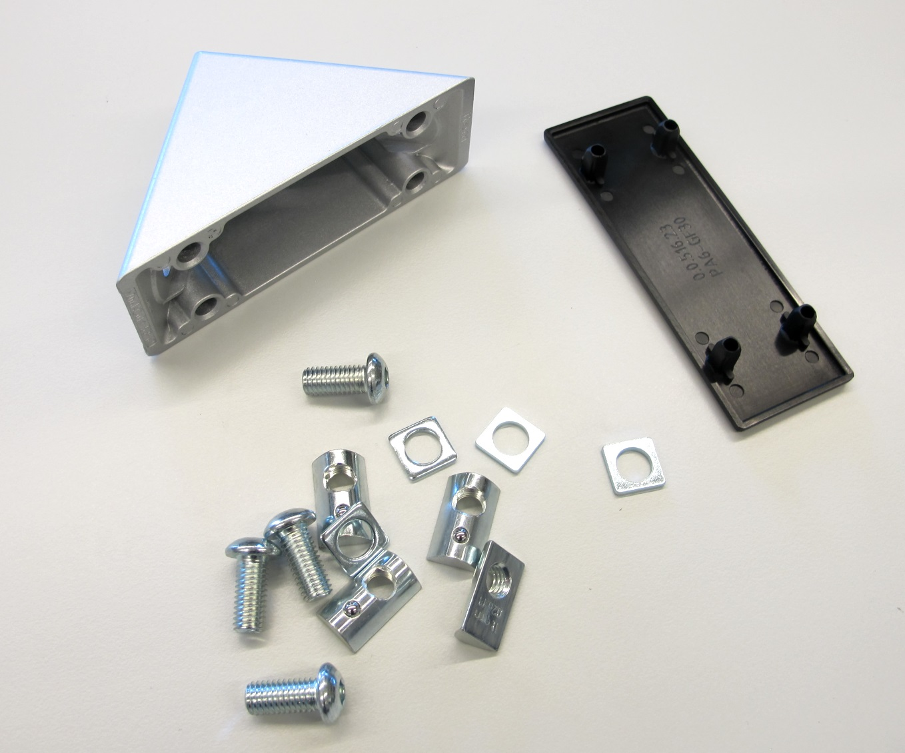   *Item 90 degree angle bracket*
* 3 x 90 degree large angle brackets - Item part number: 0.0.411.32

### End caps
   *Item end caps*
* 9 x end caps - size 8 - Item part number: 0.0.026.01

### T-slot nuts
   *Item M5 t-slot nuts*
* T-slot nuts M5 - Item part number: 0.0.480.54

### Center connector
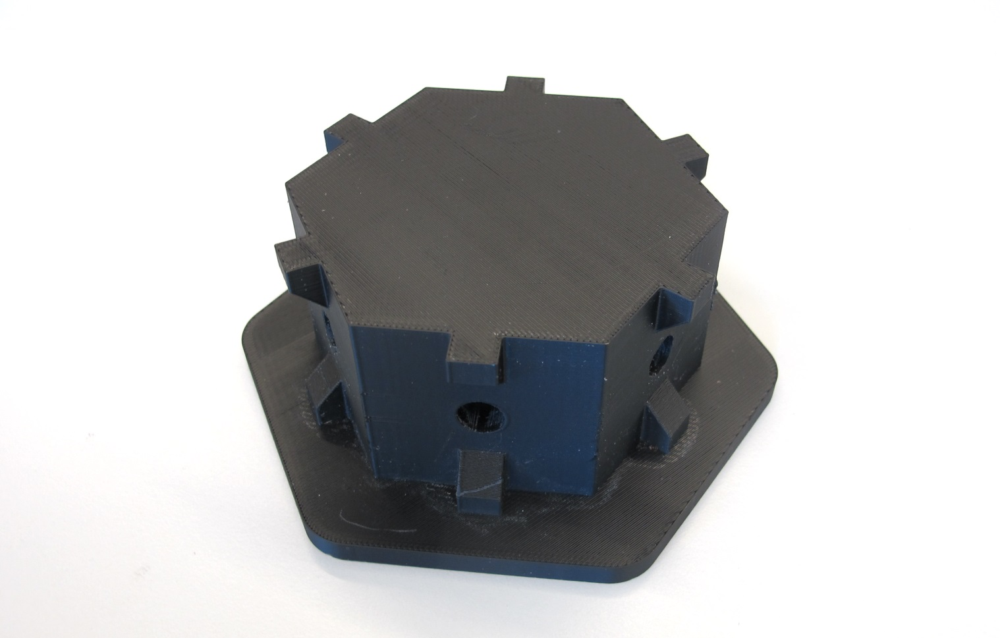   *3d printed frame center connector*

* 3d printed center connector - [STL file](/stl_files/frame_center_connector_top.STL)

### Barrier
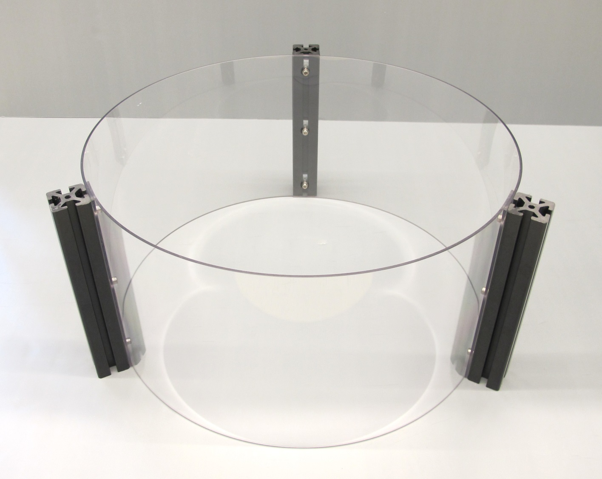   *Barrier - consisting of 3 polycarbonate sheets*

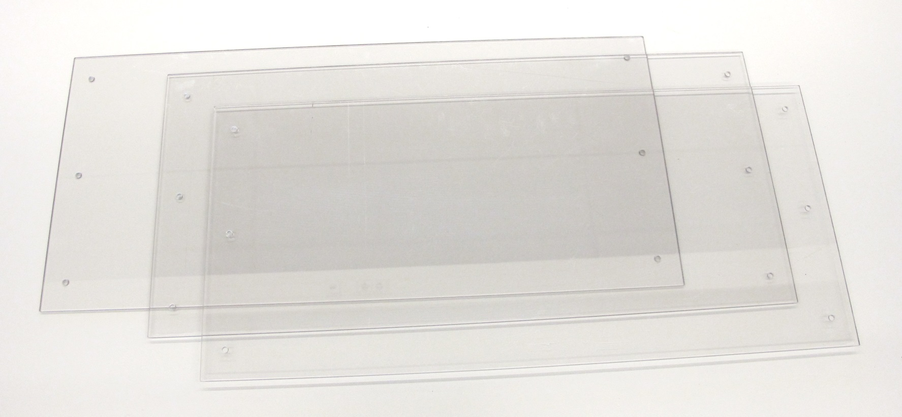   *3mm polycarbonate sheets*

* We use 3mm polycarbonate sheets to keep the objects inside of the manipulation area.
* Cut the polycarbonate sheets to size according to [this drawing](details/frame_barrier.pdf).

### Camera arm
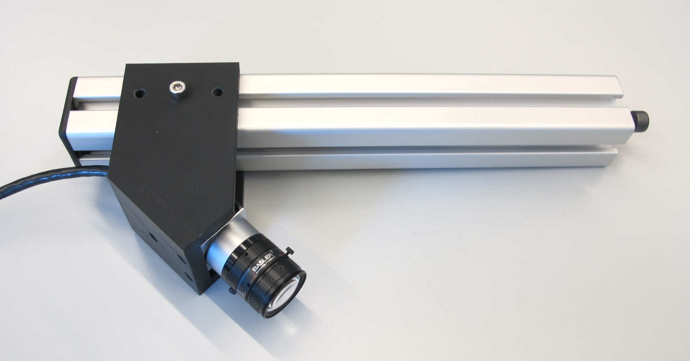   *Camera mount for Baseler camera*
* 3d printed camera mount - [STL file](/stl_files/camera_mount.STL)

### Cameras
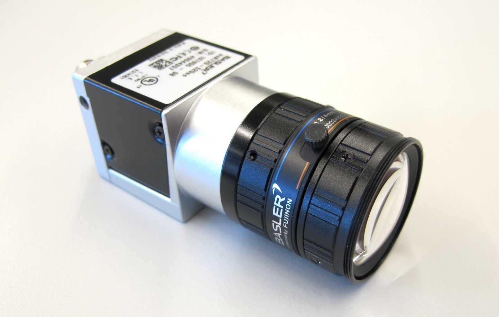   *Basler camera  with Basler lens*
* Basler camera:  acA720-520uc
* Basler lens: C125-0418-5M

## Assembly
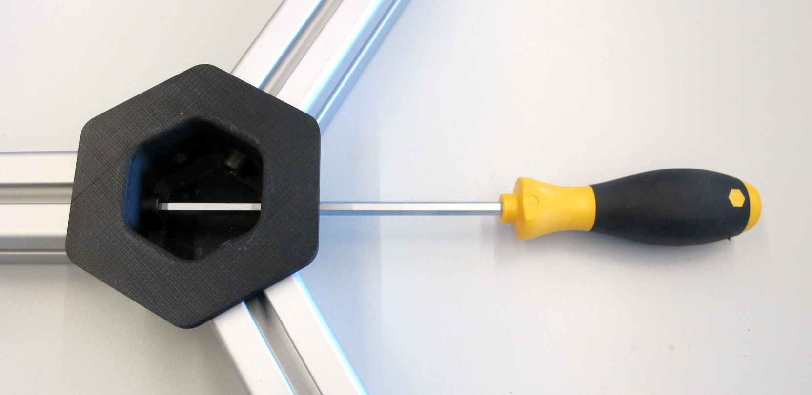   *Frame assembly - 6mm hex driver*

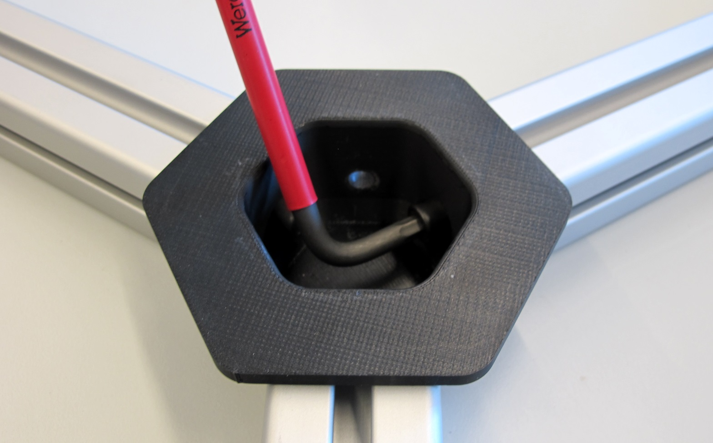   *Frame assembly - 6mm allen key*

## Transport
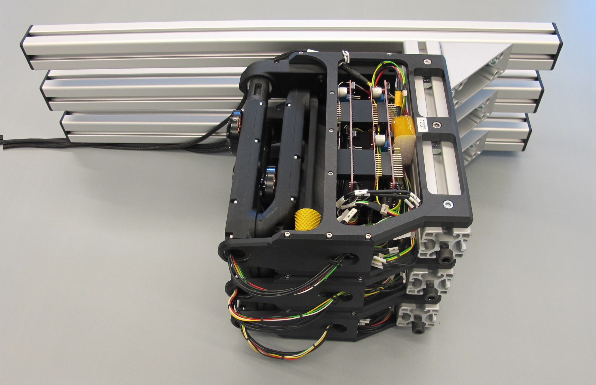   *The finger modules can be stacked for transport. Weight: 8kg*

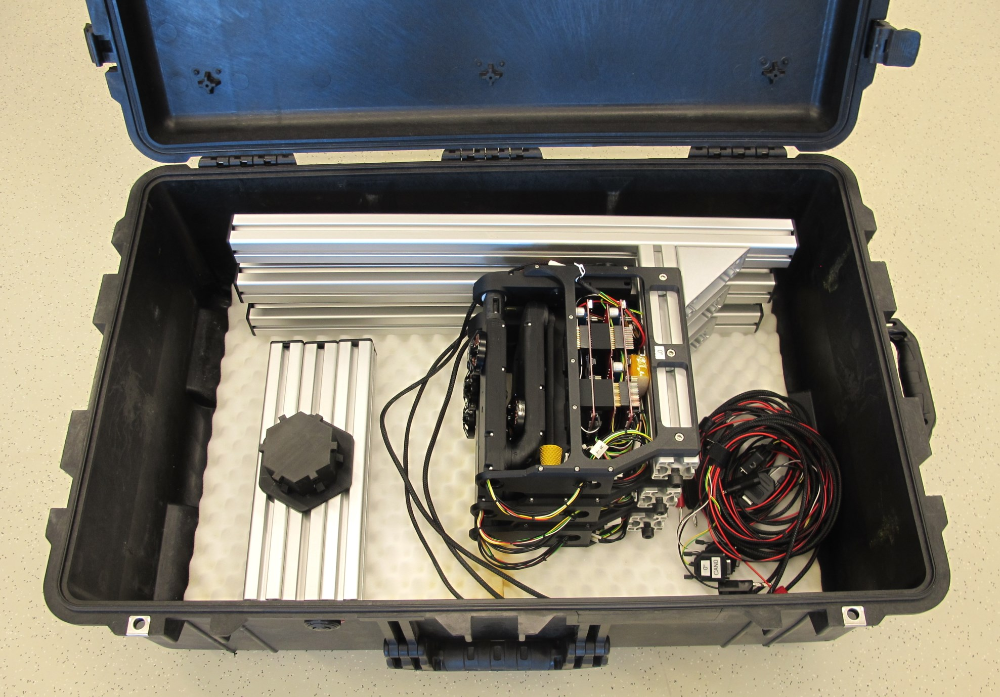   *All the components fit into a 1650 Pelican case. Total weight: 21kg*

## 3D Model for Visualization
The simplified STL files for visualization and simulation can be found here: [STL Files Visualization](stl_files_for_visualization)

<a href="details/manipulator_dimensions_visualization.pdf">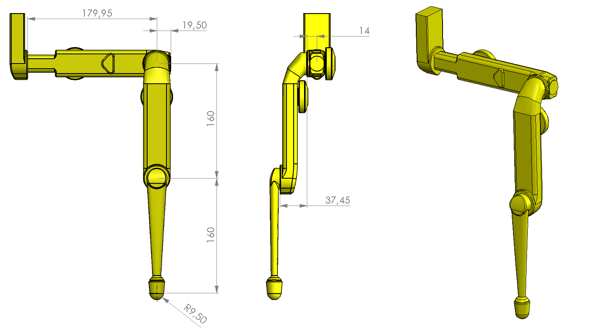</a> *Click on picture above to view the PDF drawing*

--------
## Authors
Felix Grimminger

## License
BSD 3-Clause License

## Copyright
Copyright (c) 2019-2020, Max Planck Gesellschaft and New York University

## More Information
[Open Dynamic Robot Initiative - Webpage](https://open-dynamic-robot-initiative.github.io)  
[Open Dynamic Robot Initiative - YouTube Channel](https://www.youtube.com/channel/UCx32JW2oIrax47Gjq8zNI-w)   
[Hardware Overview](../../README.md)  
[Software Overview](https://github.com/open-dynamic-robot-initiative/open-dynamic-robot-initiative.github.io/wiki)
